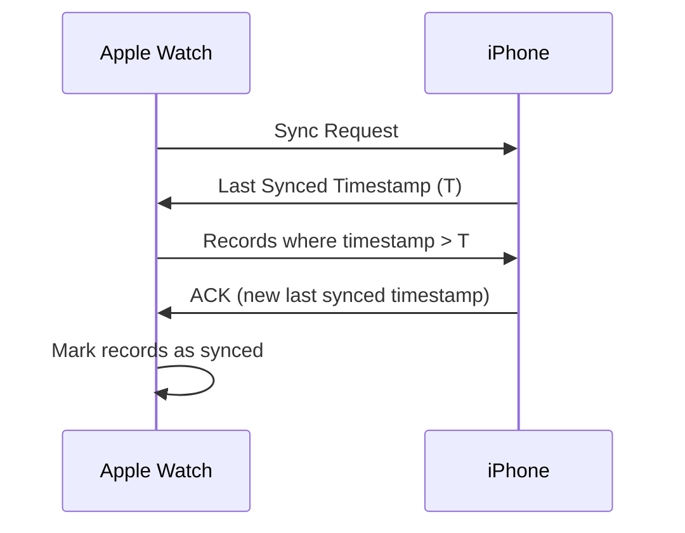
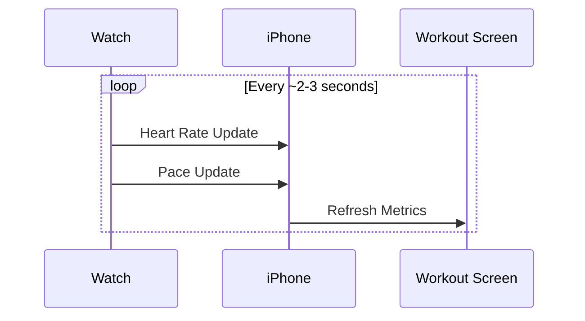

# 🍎 Apple Fitness + Apple Watch — System Design

> **Health Data Collection, Synchronization & Analytics Architecture**
> 
> **Author:** Aditya Kumar Singh
> 
> **GitHub:** [facileWizard](https://github.com/facileWizard)
>

---

## 0. Assumptions

- Millions of Apple Watch users globally
- Watch may be disconnected from iPhone for extended periods
- Health metrics are generated continuously
- Data synchronisation must be battery-efficient
- Eventual consistency is acceptable for historical health data
- Near real-time updates are required during active workouts

---

## 0.5 Requirements

### Functional

| # | Requirement |
|---|-------------|
| 1 | Track heart rate, steps, calories burned, and workouts |
| 2 | Sync Apple Watch ↔ iPhone |
| 3 | Sync iPhone ↔ Cloud |
| 4 | Display live workout metrics |
| 5 | Maintain historical health records |
| 6 | Support offline data collection |
| 7 | Generate activity rings and achievements |

### Non-Functional

| # | Requirement |
|---|-------------|
| 1 | Battery efficient |
| 2 | Secure health data storage |
| 3 | High reliability |
| 4 | Low synchronisation latency |
| 5 | Offline-first architecture |
| 6 | Scalable analytics pipeline |

---

## Design Phases

| Phase | Focus |
|-------|-------|
| 1 | High-Level Architecture |
| 2 | Health Data Collection |
| 3 | Local Storage & Offline Support |
| 4 | Watch ↔ Phone Synchronisation |
| 5 | Real-Time Workout Mode |
| 6 | Cloud Sync Architecture |
| 6.5 | Privacy & Security |
| 7 | Event-Driven Processing |
| 8 | Time-Series Storage |
| 9 | Reliability & Recovery |
| 10 | Scaling & Observability |
| 11 | Edge Cases & Tradeoffs |

---

## Phase 1 — High-Level Architecture

```
Apple Watch
    │  (BLE)
    ▼
iPhone App
    │  (HTTPS)
    ▼
Cloud API
    ├── Analytics Service
    ├── Achievement Service
    └── Backup Service
```

### Core Principle

> Apple Watch does **not** continuously upload data directly to the cloud. The iPhone acts as the synchronisation gateway — significantly reducing battery consumption on the watch.

```
Watch  →[BLE]→  iPhone  →[HTTPS]→  Cloud
```

---

## Phase 2 — Health Data Collection

### Sensors

Apple Watch continuously collects data from:

| Sensor | Metric |
|--------|--------|
| Optical Heart Sensor | Heart rate (BPM) |
| Accelerometer + Gyroscope | Steps, movement, fall detection |
| GPS | Distance, pace, route |
| Blood Oxygen Sensor | SpO₂ |
| Electrical Heart Sensor | ECG |
| Motion Coprocessor | Activity classification |

### SensorManager

Responsibilities:
- Sensor sampling at configurable intervals
- Noise filtering and outlier rejection
- Battery optimisation (adaptive sampling rates)
- Metric aggregation before local storage

### Health Event Model

```json
{
  "metric_id": "watch123_hr_1717220200",
  "watch_id": "watch123",
  "user_id": "user_456",
  "metric_type": "heart_rate",
  "value": 82,
  "unit": "bpm",
  "timestamp": "2026-05-30T10:00:00Z",
  "sync_status": "pending"
}
```

**Example events:**
- `heart_rate = 82 BPM`
- `steps_delta = +10`
- `calories_delta = +3 kcal`

---

## Phase 3 — Local Storage & Offline Support

### Problem

Sending every sensor reading immediately would drain battery and require constant connectivity.

❌ **Naive approach:**
```
Sensor → Network → Cloud  (per event)
```

✅ **Better approach:**
```
Sensor → Local Buffer → Batch Sync
```

### Watch Storage Model

```
HealthMetric
├── metric_id       (UUID, used for deduplication)
├── metric_type     (heart_rate | steps | calories | ...)
├── value
├── unit
├── timestamp
└── sync_status     (pending | synced)
```

**Storage options:** SQLite, CoreData, or a local time-series store.

### Benefits

- Watch continues recording even when iPhone is unavailable
- No health data is lost during disconnection
- Synced records can be purged to free storage

---

## Phase 4 — Watch ↔ Phone Synchronisation

### Sync Triggers

| Trigger | Description |
|---------|-------------|
| Bluetooth Reconnect | Watch comes back in range of iPhone |
| Active Workout | Elevated frequency for live metrics |
| Background Sync | Periodic sync every few minutes |

### Incremental Sync Strategy

Instead of sending all records on every sync, only send records after the last-synced timestamp:

```
Send records where timestamp > last_synced_at
```

This minimises data transfer and battery usage.

### Sync Flow



---

## Phase 5 — Real-Time Workout Mode

| Mode | Sync Behaviour |
|------|---------------|
| Normal | Batched, periodic sync |
| Workout | Near real-time (every few seconds) |

### Example — Active Run

The phone displays live metrics:
- Heart Rate
- Pace (min/km)
- Distance
- Calories burned

### Workout Sync Flow



> **Note:** During workouts the watch maintains a persistent BLE connection rather than using periodic connection windows, trading battery efficiency for latency.

---

## Phase 6 — Cloud Sync Architecture

The iPhone aggregates all watch data and uploads it to the cloud in batches.

```
Watch  →[BLE]→  iPhone  →[HTTPS Batch]→  Cloud
```

### Batch Upload API

```
POST /health/batch
```

```json
[
  { "metric_id": "...", "type": "heart_rate", "value": 82, "timestamp": "..." },
  { "metric_id": "...", "type": "steps",      "value": 10, "timestamp": "..." }
]
```

### Why Not Direct Watch → Cloud Upload?

| Reason | Detail |
|--------|--------|
| Battery savings | Cellular radio is far more power-hungry than BLE |
| Reduced cellular usage | Matters on LTE-only watch models |
| Lower network overhead | Batching reduces connection setup cost |
| Better aggregation | iPhone can pre-process and compress before upload |

---

## Phase 6.5 — Privacy & Security

> Health data is among the most sensitive categories of personal information. Security must be a first-class architectural concern, not an afterthought.

### Encryption at Every Layer

| Layer | Protection |
|-------|------------|
| Watch ↔ iPhone | BLE Encryption |
| iPhone ↔ Cloud | TLS / HTTPS |
| Cloud Storage | Encryption at rest |
| Backups | Encrypted backups |

### Access Control

- User-scoped access controls — users only access their own data
- Service-to-service authentication between internal services
- Principle of least privilege — services access only what they need

### Privacy Principles

- Health metrics processed only for authorised features
- Data retention policies enforced (e.g. auto-purge after N years)
- Audit logs maintained for sensitive data access

### Compliance Considerations

Depending on region and use case:

| Regulation | Scope |
|-----------|-------|
| GDPR | EU users — right to deletion, data portability |
| HIPAA | US healthcare data handling |
| Regional laws | Country-specific healthcare privacy requirements |

---

## Phase 7 — Event-Driven Processing

Once the cloud ingests data, it fans out to downstream consumers via a message queue.

```
Ingestion API
     │
     ▼
  Kafka
     ├── Activity Service     → Move / Exercise / Stand rings
     ├── Analytics Service    → Trends, reports, summaries
     └── Achievement Service  → Badges, streaks, milestones
```

### Kafka Topic Event Model

```json
{
  "event": "HealthMetricReceived",
  "user_id": "user_456",
  "metric_type": "heart_rate",
  "value": 82,
  "timestamp": "2026-05-30T10:00:00Z"
}
```

### Consumer Responsibilities

| Service | Output |
|---------|--------|
| Activity Service | Move ring, Exercise ring, Stand ring |
| Analytics Service | Weekly/monthly trends, activity summaries |
| Achievement Service | 10K steps badge, workout streaks, milestones |

### Achievement Idempotency

Metric replays must never generate duplicate badge awards.

```
achievement_id  (unique constraint)
user_id
achievement_type
```

A unique constraint on `(user_id, achievement_type)` — or a more granular key where appropriate — prevents duplicate awards even if the same events are replayed.

### Kafka Event Retention & Recovery

Kafka retains events for a configurable window (e.g. 7 days), enabling:

| Benefit | Scenario |
|---------|----------|
| Consumer recovery | A service crashes and replays missed events on restart |
| Event replay | Backfill a newly deployed consumer from historical events |
| Reprocessing | Re-derive ring totals after a bug fix |

```
Achievement Service fails
        ↓
Kafka retains events (7-day window)
        ↓
Service recovers and restarts
        ↓
Replays missed events from last committed offset
```

---

## Phase 8 — Time-Series Storage

Health data is fundamentally time-series: high write throughput, range queries by time window.

### Schema

```
user_id     | metric_type  | timestamp            | value
------------|--------------|----------------------|------
user_456    | heart_rate   | 2026-05-30T10:00:00Z | 82
user_456    | steps        | 2026-05-30T10:01:00Z | 10
```

### Partition Strategy

Partition by `(user_id, month)`:

| Benefit | Why |
|---------|-----|
| Faster range queries | Data for a user's month is co-located |
| Efficient retention | Drop old partitions without full table scans |
| Better write scalability | Writes spread across partitions |

### Example Queries

```sql
-- Last 24 hours of heart rate
SELECT * FROM health_metrics
WHERE user_id = 'user_456'
  AND metric_type = 'heart_rate'
  AND timestamp >= NOW() - INTERVAL '24 hours';

-- Steps this week
SELECT SUM(value) FROM health_metrics
WHERE user_id = 'user_456'
  AND metric_type = 'steps'
  AND timestamp >= DATE_TRUNC('week', NOW());
```

---

## Phase 9 — Reliability & Recovery

### Failure Scenarios

| Scenario | Mitigation |
|----------|------------|
| Watch offline | Store locally → sync on reconnect |
| iPhone offline | Buffer on iPhone → retry on connectivity |
| Cloud unavailable | Retry queue with exponential back-off |
| Watch storage full | Compress old data → force sync → delete synced records |
| Watch battery dies mid-workout | Recover from last persisted checkpoint |
| Lost connectivity during workout | Continue local recording → sync on reconnect |
| User changes phone | Cloud restoration rebuilds local state |

### Delivery Guarantee

Health data uses **at-least-once** delivery. Duplicates are possible and handled via deduplication.

### Deduplication

Every metric carries a stable `metric_id` (e.g. `watch123_hr_1717220200`). The ingestion layer ignores records whose `metric_id` already exists — making processing idempotent.

### Clock Drift

Device clocks can drift. Timestamps are reconciled server-side using the server's receive time as an upper bound, with the device timestamp preserved as the authoritative event time.

---

## Phase 10 — Scaling & Observability

### Scaling Strategy

| Component | Strategy |
|-----------|----------|
| Ingestion API | Stateless → horizontal scaling |
| Kafka | Partition by `user_id` for ordered per-user processing |
| Time-Series DB | Partition by `(user_id, month)` |
| Upload | Batch 1000 metrics per HTTP request (not 1000 requests) |

### Key Metrics to Track

| Metric | Why |
|--------|-----|
| Sync latency (P99) | Detect BLE or upload bottlenecks |
| Upload success rate | Health of iPhone → Cloud pipeline |
| Kafka consumer lag | Downstream processing backlog |
| Deduplication rate | Indicator of retry storms |
| Workout update latency | Live UX quality signal |
| Sensor ingestion rate | Watch-side health |

### SLOs

```
Workout update latency  < 3s   (P99)
Health sync success     > 99.9%
```

---

## Phase 11 — Edge Cases & Tradeoffs

### Tradeoffs Summary

| Decision | Tradeoff |
|----------|----------|
| Batch sync | Slight data delay vs. significant battery savings |
| Local-first storage | More on-device storage vs. no data loss on disconnect |
| At-least-once delivery | Possible duplicates vs. resilience to failures |
| BLE-first (not cellular) | Lower power draw vs. lower bandwidth |
| Eventual consistency | Better scalability vs. no immediate cross-device sync |
| Incremental sync | Requires reliable timestamp tracking vs. reduced transfer |

---

## Key Insights

1. **Health systems are time-series systems** — optimise storage and queries accordingly.
2. **Offline-first is non-negotiable** — users must not lose data due to connectivity.
3. **Battery constraints drive architecture** — BLE over cellular, batching over streaming, phone as gateway.
4. **The iPhone is the synchronisation gateway** — it aggregates, buffers, and uploads on behalf of the watch.
5. **Event-driven processing enables scale** — decouples ingestion from ring calculation, analytics, and achievements.
6. **Deduplication is essential** — at-least-once delivery means idempotency must be built in from the start.
7. **Privacy and security are first-class concerns** — health data requires encryption at every layer and compliance by design.

---

## Summary

A production-grade Apple Fitness architecture requires five layers working in concert:

```
┌─────────────────────────────────────────────────┐
│  Apple Watch  — Sensor collection + local buffer │
├─────────────────────────────────────────────────┤
│  BLE Sync     — Incremental, battery-aware sync  │
├─────────────────────────────────────────────────┤
│  iPhone App   — Aggregation gateway + retry      │
├─────────────────────────────────────────────────┤
│  Cloud API    — Batch ingest → Kafka → Consumers │
├─────────────────────────────────────────────────┤
│  Time-Series DB — Partitioned by user + month    │
└─────────────────────────────────────────────────┘
```

The result is a **battery-efficient, privacy-focused, offline-resilient, and horizontally scalable** fitness ecosystem capable of supporting millions of active users globally.
