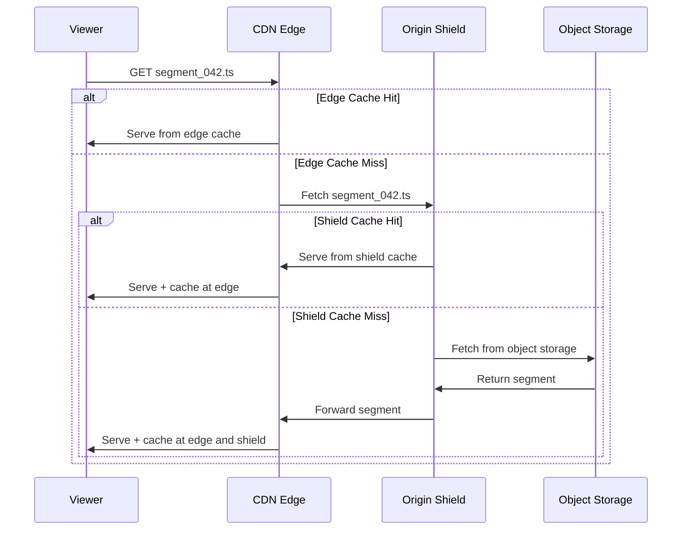
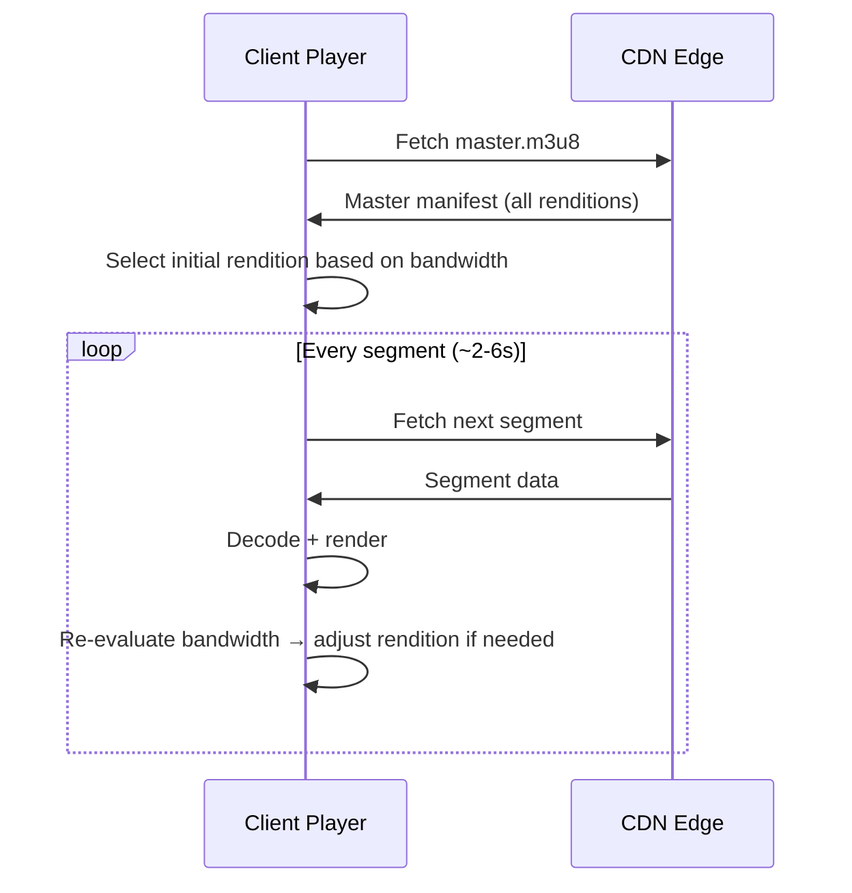
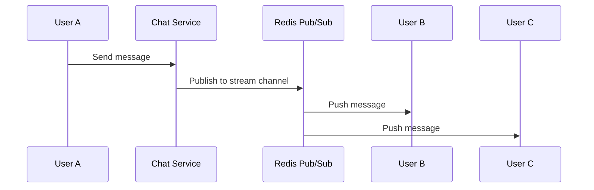
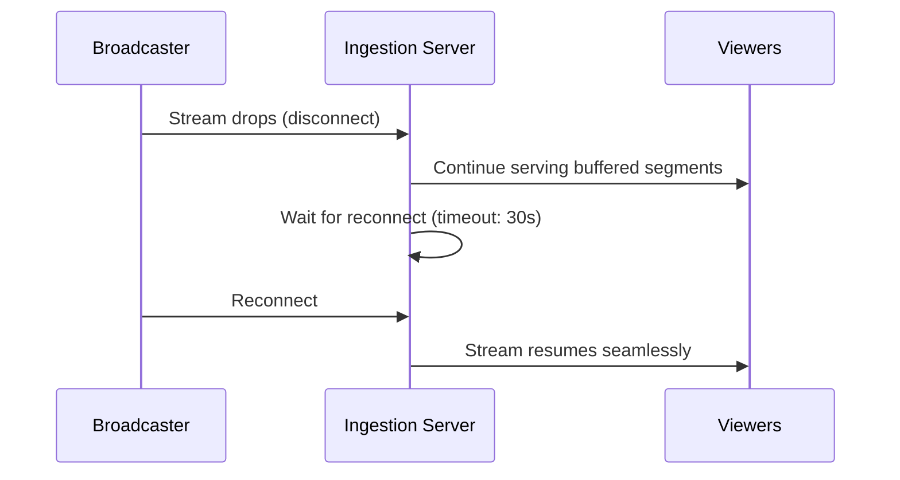

# 📺 Live Video Streaming Platform — System Design

> **Hotstar / YouTube Live Streaming Architecture**
> 
> **Author:** Aditya Kumar Singh
> 
> **GitHub:** [facileWizard](https://github.com/facileWizard)
>
---

## 0. Assumptions

- Millions of concurrent viewers per event
- Multiple live events running simultaneously
- Global audience across regions
- Clients include web, mobile, TV, and tablets
- Standard live latency of 10–30 seconds acceptable for most events
- Low-latency mode required for interactive experiences
- Eventual consistency acceptable for analytics
- High availability required during premium events

---

## 0.5 Requirements

### Functional

| # | Requirement |
|---|-------------|
| 1 | Stream live video to millions of viewers |
| 2 | Support adaptive bitrate streaming (ABR) |
| 3 | Minimise buffering |
| 4 | Support DVR / rewind |
| 5 | Support live chat |
| 6 | Collect real-time analytics |
| 7 | Handle stream interruptions gracefully |

### Non-Functional

| # | Requirement |
|---|-------------|
| 1 | High availability |
| 2 | Low latency |
| 3 | Horizontal scalability |
| 4 | Global distribution |
| 5 | Fault tolerance |
| 6 | Efficient bandwidth utilisation |
| 7 | Content security |

---

## Design Phases

| Phase | Focus |
|-------|-------|
| 1 | High-Level Architecture |
| 2 | Video Ingestion |
| 3 | Transcoding Pipeline |
| 4 | Segment Storage |
| 5 | CDN Distribution |
| 6 | Viewer Playback |
| 6.5 | Security & Access Control |
| 6.6 | Low-Latency Streaming |
| 7 | Live Chat |
| 8 | Analytics Pipeline |
| 9 | Reliability & Recovery |
| 10 | Scaling & Observability |
| 11 | Edge Cases & Tradeoffs |

---

## Phase 1 — High-Level Architecture

```
Broadcaster
     │  (RTMP / SRT / WebRTC)
     ▼
Ingestion Cluster
     │
     ▼
Transcoding Cluster
     │
     ▼
Object Storage
     │
     ▼
CDN Origin
     │
     ▼
CDN Edge Network
     │
     ▼
Viewers (Web / Mobile / TV)
```

### Core Principle

> Video is processed once and distributed many times. A single broadcaster stream is transformed into cacheable segments and replicated globally through the CDN — allowing millions of viewers to watch without overwhelming origin infrastructure.

---

## Phase 2 — Video Ingestion

### Supported Protocols

| Protocol | Latency | Best For |
|----------|---------|----------|
| RTMP | 5–10s | OBS, Streamlabs, broadcast software |
| SRT | 2–4s | Unstable or high-packet-loss networks |
| WebRTC | <1s | Ultra-low-latency interactive streams |

**Typical flow:**

```
OBS / Broadcast Software
        │  (RTMP)
        ▼
Ingestion Cluster
```

### Ingestion Responsibilities

- Stream key authentication and validation
- Codec and bitrate verification
- Broadcaster disconnect detection
- Temporary buffering against upload spikes
- Forwarding a clean, stable stream to the transcoding cluster

---

## Phase 3 — Transcoding Pipeline

### Problem

Different users have vastly different network conditions. A single high-bitrate stream would fail for viewers on mobile or poor connections.

### Multi-Rendition Output

```
Incoming Stream (raw)
        │
        ▼
Transcoder
        ├── 1080p  (6 Mbps)
        ├── 720p   (3 Mbps)
        ├── 480p   (1.5 Mbps)
        ├── 360p   (800 Kbps)
        └── 240p   (400 Kbps)
```

### Adaptive Bitrate Streaming (ABR)

The player automatically switches renditions based on:
- Available network bandwidth
- Buffer health
- Device capability

### Video Segmentation

Each rendition is split into fixed-length chunks (typically 2–6 seconds):

```
Rendition: 720p
├── segment_001.ts  (2s)
├── segment_002.ts  (2s)
└── segment_003.ts  (2s)
```

**Why segments?**

| Without Segments | With Segments |
|-----------------|---------------|
| One giant continuous stream | Small cacheable chunks |
| Hard to cache at CDN | Each segment cached independently |
| Poor fault recovery | Resume from any segment |
| Quality switching requires restart | Seamless ABR switches between segments |

---

## Phase 4 — Segment Storage

### Architecture

```
Transcoder  →  Object Storage  →  CDN Origin  →  CDN Edge  →  Viewer
```

### Storage Layout

```
/streams/{stream_id}/
    └── master.m3u8                  ← master manifest (all renditions)
/streams/{stream_id}/1080p/
    ├── playlist.m3u8                ← per-rendition manifest
    ├── segment_001.ts
    └── segment_002.ts
/streams/{stream_id}/720p/
    ├── playlist.m3u8
    ├── segment_001.ts
    └── segment_002.ts
```

### Manifest File (HLS)

The viewer's player first fetches the master manifest:

```
# master.m3u8
#EXTM3U
#EXT-X-STREAM-INF:BANDWIDTH=6000000,RESOLUTION=1920x1080
1080p/playlist.m3u8
#EXT-X-STREAM-INF:BANDWIDTH=3000000,RESOLUTION=1280x720
720p/playlist.m3u8
#EXT-X-STREAM-INF:BANDWIDTH=1500000,RESOLUTION=854x480
480p/playlist.m3u8
```

### DVR / Rewind Support

A rolling window of segments is retained in storage (e.g. last 4 hours), enabling pause, rewind, and catch-up playback. Older segments are expired via lifecycle policies.

---

## Phase 5 — CDN Distribution

### Why CDN?

❌ **Without CDN:**
```
Viewer  →  Origin  (origin overloaded, high latency for distant viewers)
```

✅ **With CDN + Origin Shield:**
```
Viewer  →  CDN Edge  →  Origin Shield  →  Origin Storage
```

### Origin Shield

Origin Shield is an additional caching layer between CDN edges and the origin:

| Benefit | Why |
|---------|-----|
| Protects origin from traffic spikes | Edges hit Shield before origin |
| Reduces duplicate cache misses | Multiple edges share one Shield cache |
| Improves overall cache hit ratio | Fewer cold misses reach object storage |

### CDN Flow



### CDN Pre-Warming

For known scheduled events (IPL Finals, World Cup), frequently requested manifests and initial segments are loaded into edge caches before the stream starts:

- Faster viewer startup
- Lower origin traffic at stream launch
- Better cache hit rates from the first second

---

## Phase 6 — Viewer Playback

### Playback Flow



### Adaptive Bitrate Logic

```
Bandwidth high + buffer healthy  →  upgrade rendition
Bandwidth low + buffer draining  →  downgrade rendition
Buffer empty                     →  stall (buffering spinner)
```

### Buffer Strategy

| Buffer Size | Effect |
|-------------|--------|
| Large (20–30s) | Stable playback, higher delay behind live edge |
| Small (2–5s) | Near real-time, more sensitive to fluctuations |

> **Tradeoff:** Larger buffers reduce buffering events but increase how far behind live the viewer is. Sports platforms typically target 10–30s; interactive use cases target <5s.

---

## Phase 6.5 — Security & Access Control

### Broadcaster Protection

- **Stream keys** — unique private keys; invalid keys rejected at ingestion
- **IP allowlisting** — optionally restrict ingestion to known broadcaster IPs
- **Bitrate enforcement** — streams exceeding limits are throttled or rejected

### Viewer Protection

| Mechanism | Purpose |
|-----------|---------|
| JWT | User identity and authentication |
| Signed URLs | Time-limited segment access for paid content |
| Geo-blocking | Regional rights management |
| DRM | Prevent redistribution of premium streams |

**DRM options:** Widevine (Android/Chrome), FairPlay (iOS/Safari), PlayReady (Windows)

### Content Protection Flow

```
Viewer requests stream
        │
        ▼
Auth Service validates JWT / entitlement
        │
        ▼
Issues signed CDN token (short TTL)
        │
        ▼
CDN validates token on each segment request
```

### Encryption at Every Layer

| Layer | Protection |
|-------|------------|
| Broadcaster → Ingestion | TLS / SRTP |
| Internal services | TLS |
| CDN → Viewer | HTTPS |
| Premium stored segments | AES-128 + key server |

---

## Phase 6.6 — Low-Latency Streaming

### Why It Matters

Some products prioritise latency over maximum scale:

- Sports betting
- Live auctions
- Interactive gaming
- Virtual classrooms

### Streaming Options

| Technology | Latency | Scale |
|-----------|---------|-------|
| Standard HLS | 15–30s | Massive |
| Low-Latency HLS (LL-HLS) | 2–5s | High |
| Low-Latency DASH (LL-DASH) | 2–5s | High |
| WebRTC | <1s | Limited |

### Tradeoffs

| Approach | Benefit | Drawback |
|----------|---------|----------|
| Standard HLS | Maximum scale, battle-tested | Higher delay |
| LL-HLS / LL-DASH | Good balance of latency and scale | More frequent segment requests, more complex |
| WebRTC | True real-time | Complex infrastructure, hard to scale past ~100K viewers |

> **Key insight:** It's not a binary choice. LL-HLS is a practical middle ground — it cuts latency to 2–5s while still leveraging CDN infrastructure. WebRTC is reserved for genuinely interactive use cases.

---

## Phase 7 — Live Chat

### Why Separate from Video?

| Dimension | Video | Chat |
|-----------|-------|------|
| Message size | Large (MBs per segment) | Tiny (~100 bytes) |
| Delivery model | Pull (client fetches segments) | Push (server pushes messages) |
| Scaling pattern | CDN fan-out | WebSocket fan-out |
| Latency requirement | Seconds acceptable | Near real-time |

### Architecture

```
Users
  │  (WebSocket)
  ▼
WebSocket Gateway
  │
  ├── Chat Service
  │       │
  │       ├── Redis Pub/Sub  (real-time fan-out)
  │       └── Message Store  (recent history for late joiners)
```

### Chat Message Model

```json
{
  "message_id": "msg_abc123",
  "stream_id":  "stream_789",
  "user_id":    "user_456",
  "username":   "Aditya",
  "text":       "What a goal! 🔥",
  "timestamp":  "2026-05-30T18:45:00Z"
}
```

### Fan-Out Flow



### Abuse Mitigation

| Problem | Mitigation |
|---------|------------|
| Chat flood / spam | Rate limiting per user (e.g. 1 msg/second) |
| High-traffic peak moments | Slow mode — minimum interval between messages |
| Offensive content | Keyword filtering + moderation queue |
| Bot attacks | CAPTCHA + account age requirements |

---

## Phase 8 — Analytics Pipeline

### Events Tracked

| Event | Purpose |
|-------|---------|
| `stream_start` | Viewer joined |
| `stream_end` | Viewer left, watch duration |
| `quality_change` | ABR switches, network quality signal |
| `buffering_start/end` | Buffering frequency and duration |
| `error` | Playback failures |

### Event Model

```json
{
  "event_id":   "evt_xyz",
  "user_id":    "user_456",
  "stream_id":  "stream_789",
  "event_type": "buffering_start",
  "quality":    "720p",
  "timestamp":  "2026-05-30T18:45:10Z",
  "metadata": {
    "buffer_level_s": 1.2,
    "cdn_edge":       "mumbai-edge-03"
  }
}
```

### Pipeline

```
Player Events
      │
      ▼
Kafka  (partitioned by stream_id)
      ├── Live Dashboard     →  Concurrent viewer count
      ├── Analytics Service  →  Watch time, geographic heatmaps
      └── Alerting Service   →  Buffering spike → on-call alert
```

### Key Metrics Generated

- Concurrent viewers (real-time)
- Watch duration distribution
- Geographic viewer distribution
- Quality distribution (% watching each rendition)
- Buffering ratio by region and CDN edge

---

## Phase 9 — Reliability & Recovery

### Failure Scenarios

| Scenario | Mitigation |
|----------|------------|
| Broadcaster disconnects | Detect timeout → show reconnect screen → auto-reconnect |
| Transcoder failure | Hot standby takes over; buffered segments remain available |
| CDN edge failure | DNS failover to nearest healthy edge |
| Storage failure | Cross-region replication |
| Chat failure | Video continues unaffected; chat reconnects independently |
| Viral traffic spike | CDN absorbs; transcoders autoscale; pre-warm for known events |
| Multiple premium events | Reserved transcoding capacity + CDN bandwidth |

### Stream Recovery Flow



---

## Phase 10 — Scaling & Observability

### Scaling Strategy

| Component | Strategy |
|-----------|----------|
| Ingestion | Horizontal scaling; load balance by stream ID |
| Transcoding | Autoscaling worker pool; queue-based task dispatch |
| Object Storage | Managed (S3/GCS) — inherently scalable |
| CDN | Global edge network; absorbs viewer fan-out |
| Chat | WebSocket gateway sharding by stream ID |
| Analytics | Kafka partitioned by `stream_id` |

### Key Metrics to Track

| Metric | Why |
|--------|-----|
| Concurrent viewer count | Core capacity signal |
| Video startup time (P95) | First-impression UX |
| Buffering ratio | Playback quality signal |
| CDN cache hit ratio | Cost and latency efficiency |
| Transcoding lag | Delay between broadcast and availability |
| Ingestion error rate | Broadcaster experience |
| Chat message delivery latency | Chat UX quality |

### SLOs

```
Playback success rate     > 99.9%
Video startup time        < 2s    (P95)
Buffering ratio           < 1%
Live latency (standard)   < 30s
Live latency (LL mode)    < 5s
```

---

## Phase 11 — Edge Cases & Tradeoffs

### Edge Cases

| Scenario | Mitigation |
|----------|------------|
| Viral traffic spike | CDN + autoscaling transcoders; pre-warm for known events |
| Chat flood at peak moment | Per-user rate limiting + slow mode |
| Regional CDN outage | DNS rerouting to healthy edge |
| Viewer network drop | ABR falls back to lower rendition; buffer provides continuity |
| Broadcaster clock drift | Ingestion server timestamps segments server-side |
| Multiple simultaneous premium events | Pre-allocate transcoding + CDN capacity |

### Tradeoffs

| Decision | Tradeoff |
|----------|----------|
| Larger segment buffer | More stable playback vs. higher live delay |
| More renditions | Better UX across devices vs. more transcoding compute |
| Aggressive CDN caching | Lower cost and latency vs. risk of stale segments |
| Multi-region replication | Higher reliability vs. higher storage cost |
| WebRTC low-latency | Near real-time vs. complex infra, limited scale |
| Separate chat system | Independent scaling vs. additional operational overhead |

---

## Key Insights

1. **CDN is the primary scaling component** — it is what makes millions of concurrent viewers possible without overloading origin.
2. **Segment-based delivery enables everything** — caching, ABR, DVR, and fault recovery all depend on the stream being chunked.
3. **Video and chat are fundamentally different systems** — different protocols, scaling patterns, and failure modes; keep them separate.
4. **Adaptive bitrate is essential for global reach** — network conditions vary enormously; ABR prevents constant buffering on poor connections.
5. **Kafka enables independent analytics scaling** — decouples data collection from processing; consumers can be added without touching the video path.
6. **Pre-warming CDN matters for known events** — for scheduled premium events, pre-warm edges before stream start to avoid cold-cache startup delays.
7. **Security must cover both ends** — stream key auth protects broadcasters; signed tokens and DRM protect premium viewer content.
8. **Low-latency is a spectrum, not a binary** — LL-HLS is a practical middle ground; WebRTC is reserved for genuinely interactive use cases.

---

## Summary

```
┌──────────────────────────────────────────────────────┐
│  Broadcaster                                         │
│  RTMP / SRT / WebRTC → Ingestion Cluster             │
├──────────────────────────────────────────────────────┤
│  Transcoding                                         │
│  Multi-rendition (1080p → 240p) + Segmentation       │
├──────────────────────────────────────────────────────┤
│  Segment Storage                                     │
│  Object Store + HLS Manifests + DVR Window           │
├──────────────────────────────────────────────────────┤
│  CDN                                                 │
│  Origin Shield + Global Edge — absorbs viewer fan-out│
├──────────────────────────────────────────────────────┤
│  Viewers                                             │
│  ABR Player — adaptive quality, low buffering        │
├──────────────────────────────────────────────────────┤
│  Supporting Systems                                  │
│  Live Chat (WebSocket + Redis) + Analytics (Kafka)   │
└──────────────────────────────────────────────────────┘
```

The result is a **globally distributed, fault-tolerant, secure, and horizontally scalable** live streaming platform capable of serving millions of concurrent viewers with adaptive quality, low buffering, and reliable playback.
