# MyGate — Notification System Design

> Visitor Entry + Pre-Approval Notification Architecture
>
> **Author:** Aditya

---

## Table of Contents

- [0. Assumptions](#0-assumptions)
- [0.5 Requirements](#05-requirements)
- [Phase 1 — High-Level Architecture](#phase-1--high-level-architecture-hld)
- [Phase 2 — Visitor Entry Flow](#phase-2--visitor-entry-flow)
- [Phase 3 — Pre-Approval System](#phase-3--pre-approval-system)
- [Phase 4 — Notification Architecture](#phase-4--notification-architecture)
- [Phase 5 — Scaling & Reliability](#phase-5--scaling--reliability)
- [Phase 6 — Edge Cases & Tradeoffs](#phase-6--edge-cases--tradeoffs)
- [Tech Stack Summary](#tech-stack-summary)
- [Key Insights](#key-insights)

---

## 0. Assumptions

- Large apartment societies with thousands of residents
- Multiple security gates per society
- Millions of notifications per day
- Mobile-first system (Android + iOS)
- Eventual consistency acceptable for notifications
- Each resident may have multiple registered devices

---

## 0.5 Requirements

### Functional

- Notify residents when visitors arrive at the gate
- Support resident pre-approval for visitors
- Allow guards to verify entry approvals
- Support delivery agents, guests, cabs, and domestic help
- Real-time push notifications to residents
- Maintain visitor logs and audit history
- QR-code based guest passes

### Non-Functional

| Requirement | Target |
|---|---|
| Notification latency | < 2 seconds (P99) |
| Availability | 99.9% uptime during peak hours |
| Notification delivery | At-least-once with deduplication |
| Multi-tenancy | Logical isolation per society |
| Data retention | Visitor logs retained for 90 days |
| Privacy | Residents cannot view other flats' visitor data |

---

## Design Phases

```
Phase 1 → HLD (Product Architecture)
Phase 2 → Visitor Entry Flow
Phase 3 → Pre-Approval System
Phase 4 → Notification Architecture
Phase 5 → Scaling + Reliability
Phase 6 → Edge Cases + Tradeoffs
```

---

## Phase 1 — High-Level Architecture (HLD)

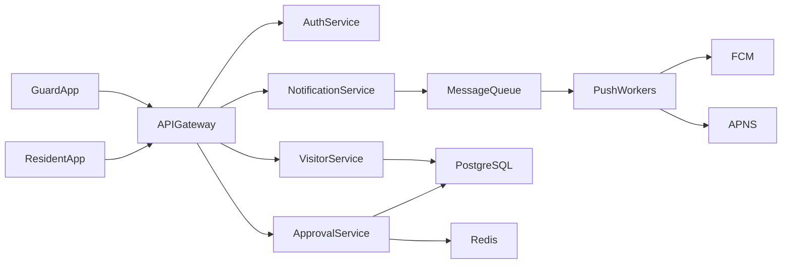

**Core Services:**

| Service | Responsibility |
|---|---|
| Auth Service | JWT issuance, role-based access (guard / resident / admin) |
| Visitor Service | Gate entry, visitor logging, audit trail |
| Approval Service | Pre-approvals, QR passes, guard-side validation |
| Notification Service | Event fan-out, push delivery, retry management |
| Presence Service | WebSocket connections, online/offline tracking |

### End-to-End Flow (Simplified)

1. Visitor arrives at gate
2. Guard enters visitor details in Guard App
3. Visitor Service checks for an active pre-approval
4. **If pre-approved** → instant entry + notification to resident
5. **If not pre-approved** → approval request pushed to resident
6. Resident approves or rejects via app
7. Guard receives the decision in real-time
8. Entry stored in audit log

---

## Phase 2 — Visitor Entry Flow

### 2.1 Problem

Residents must receive near real-time notifications when visitors arrive, and guards need a low-latency confirmation so they do not hold up entry queues.

### 2.2 Gate Entry Sequence

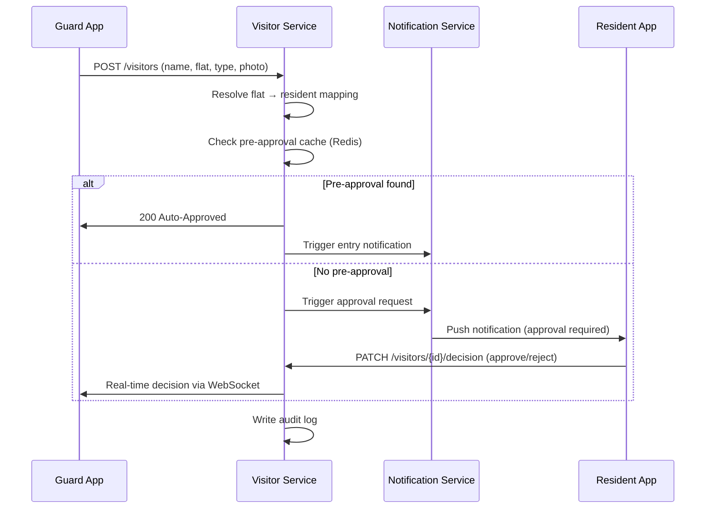

### 2.3 Visitor Data Model

```
VisitorEntry {
  visitor_id       UUID, PK
  society_id       UUID, FK  -- multi-tenant partition key
  flat_id          UUID, FK
  resident_id      UUID, FK
  visitor_type     ENUM (guest | delivery | cab | domestic_help)
  visitor_name     VARCHAR
  vehicle_number   VARCHAR (nullable)
  photo_url        VARCHAR (nullable)
  entry_status     ENUM (pending | approved | rejected | auto_approved)
  created_at       TIMESTAMPTZ
  resolved_at      TIMESTAMPTZ (nullable)
}
```

**Indexes:**
- `(society_id, created_at DESC)` — for audit log queries
- `(flat_id, entry_status)` — for resident-side history

### 2.4 Notification Event Payload

```json
{
  "event_id": "uuid",
  "event_type": "visitor.arrival",
  "flat_id": "uuid",
  "visitor_id": "uuid",
  "visitor_name": "John Doe",
  "visitor_type": "guest",
  "timestamp": "2024-01-01T09:00:00Z"
}
```

---

## Phase 3 — Pre-Approval System

### 3.1 Core Idea

Residents pre-authorize visitors before arrival, eliminating the round-trip notification for common use cases (domestic help, regular deliveries, expected guests).

### 3.2 Architecture

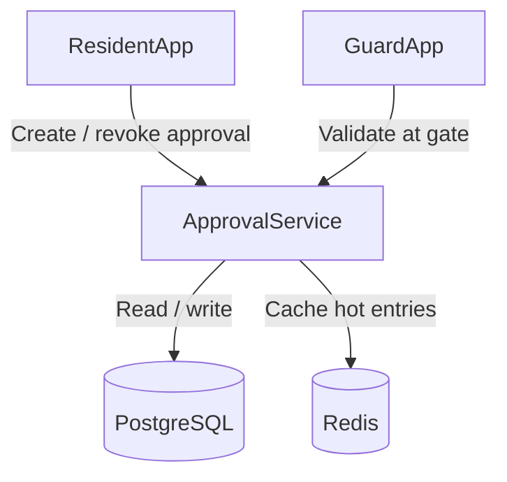

### 3.3 Pre-Approval Flow

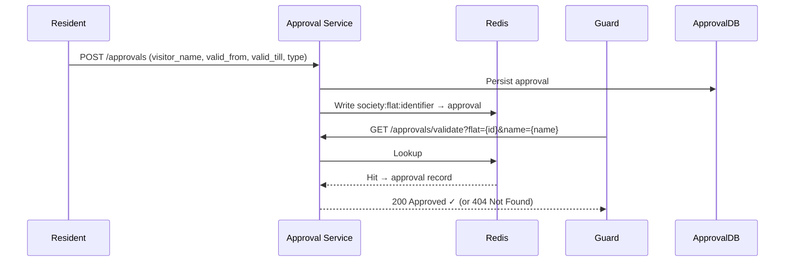

### 3.4 Pre-Approval Data Model

```
PreApproval {
  approval_id      UUID, PK
  resident_id      UUID, FK
  society_id       UUID, FK
  visitor_name     VARCHAR
  visitor_phone    VARCHAR (nullable)
  visitor_type     ENUM
  valid_from       TIMESTAMPTZ
  valid_till       TIMESTAMPTZ
  one_time_pass    BOOLEAN  -- invalidated after single use
  status           ENUM (active | used | expired | revoked)
  created_at       TIMESTAMPTZ
}
```

### 3.5 Cache Strategy

Frequently accessed approvals are cached in Redis to avoid DB hits during rush hours:

```
Key:   {society_id}:{flat_id}:{visitor_identifier}
Value: serialized PreApproval object
TTL:   until valid_till + 5 min buffer
```

**Invalidation:** Explicit delete on revoke; TTL-based expiry otherwise.

**Stale data risk:** A revoked approval may still be served from cache for up to 5 minutes. This is an accepted tradeoff for latency. Guards can fall back to a manual call.

### 3.6 QR-Based Visitor Passes

Residents can generate short-lived QR passes for guests.

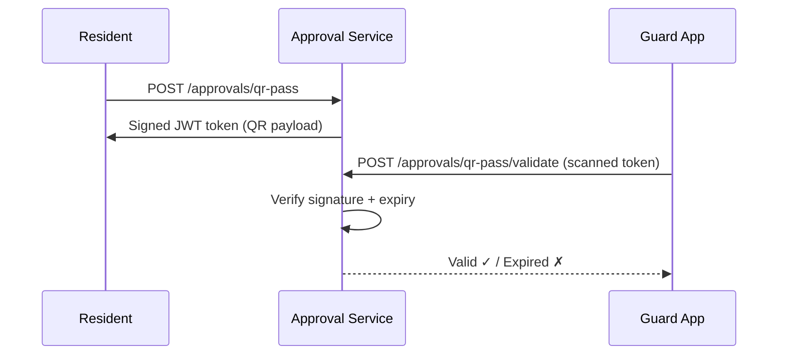

**QR Token Structure:**

```json
{
  "approval_id": "uuid",
  "flat_id": "uuid",
  "visitor_name": "Jane Doe",
  "exp": 1700000000,
  "sig": "<HMAC-SHA256>"
}
```

- Signed server-side with a per-society secret
- Short expiry window (configurable; default 24 hours)
- One-time-use flag supported

---

## Phase 4 — Notification Architecture

### 4.1 Requirements

Notifications must:

- Arrive in near real-time (< 2s P99)
- Support retries with exponential backoff
- Avoid duplicates via idempotency
- Handle offline devices gracefully
- Degrade gracefully if push provider is slow

### 4.2 Event-Driven Architecture

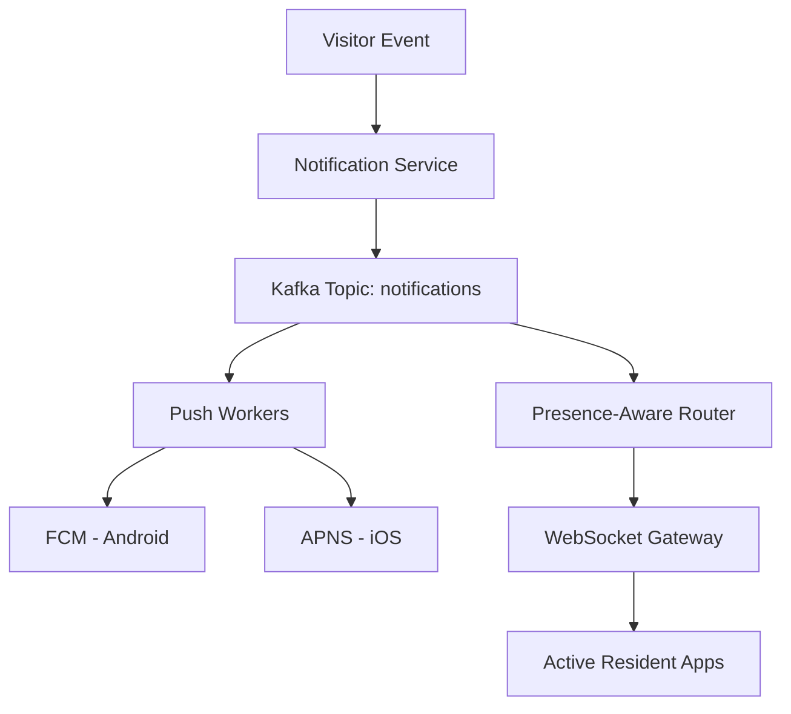

### 4.3 Delivery Flow

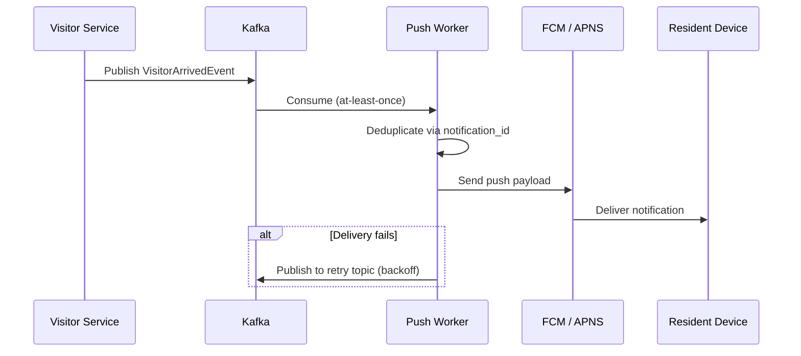

### 4.4 Retry Logic

- **Exponential backoff:** 1s → 5s → 30s → 5min
- **Dead-letter queue (DLQ):** after 5 failed attempts; alerts on-call
- **Idempotency key:** `notification_id` prevents duplicate pushes on retries

### 4.5 Offline Device Handling

- FCM / APNS store notifications for offline devices (platform TTL applies)
- On app open, resident app fetches missed events via `GET /notifications?since={last_seen}`
- Notifications marked `delivered` only after client acknowledgement

### 4.6 Why a Queue is Necessary

| Without Queue | With Queue |
|---|---|
| Gate entry latency couples to push provider latency | Visitor registration decouples from push delivery |
| Push provider outage blocks guard operations | Guard operations continue; notifications catch up |
| No retry or backoff | Configurable retry pipeline |

### 4.7 Hybrid: Push + WebSocket

Push notifications alone have limitations:

- OS battery optimizations can delay delivery
- Not suitable for guard's real-time confirmation workflow

**Strategy:**

```
Resident app in foreground  → WebSocket real-time update
Resident app in background  → Push notification (FCM / APNS)
```

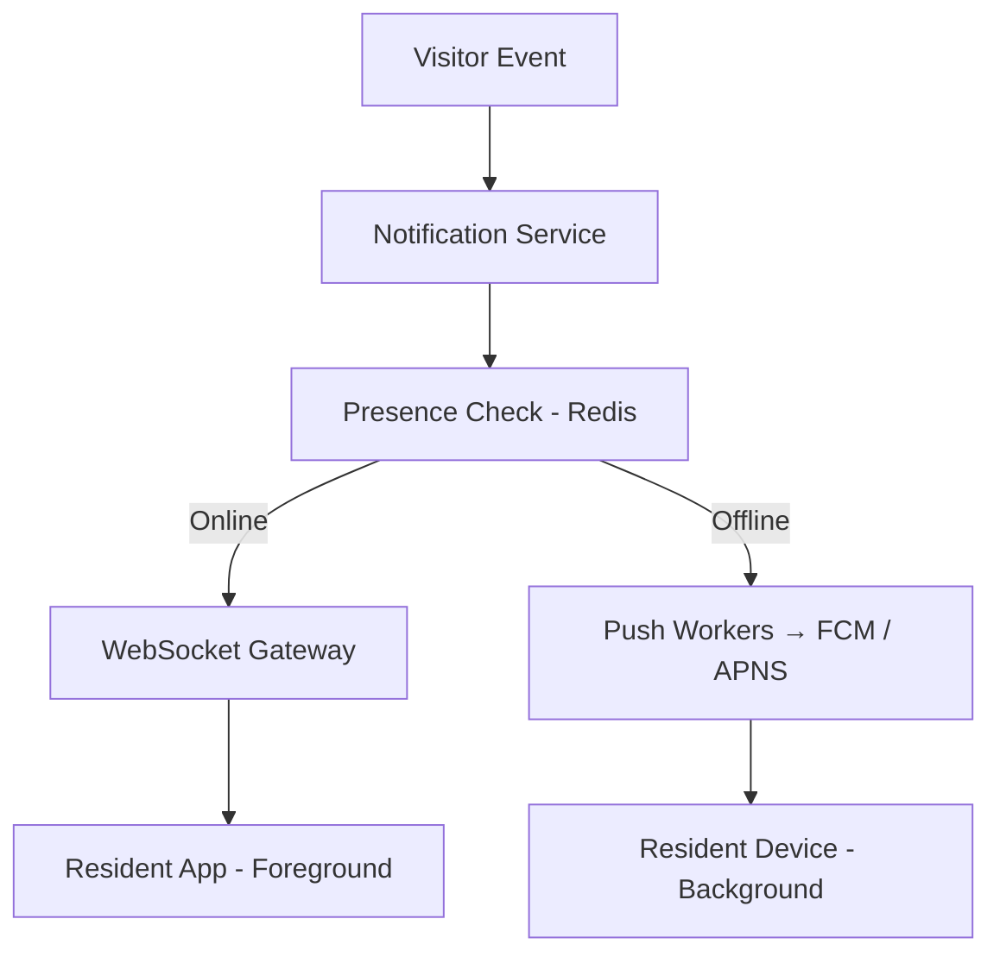

### 4.8 Presence Service

Tracks whether a resident's device is actively connected.

```
Presence {
  resident_id    UUID
  socket_id      VARCHAR
  device_id      VARCHAR
  last_seen      TIMESTAMPTZ
  online_status  ENUM (online | offline)
}
```

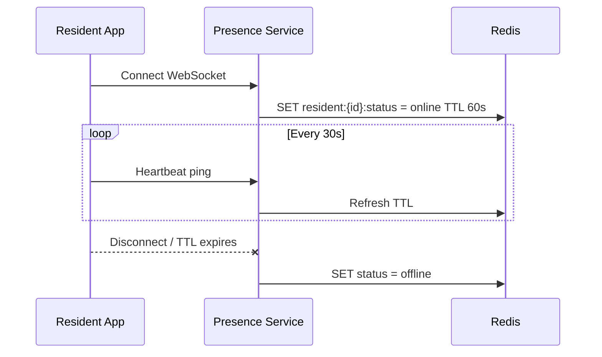

### 4.9 Offline Guard Device Handling

Gate internet may fail intermittently. Guard operations must continue.

**Strategy:**

- Guard app maintains a local SQLite cache of active approvals (synced every 15 min)
- Events generated during offline periods are queued locally

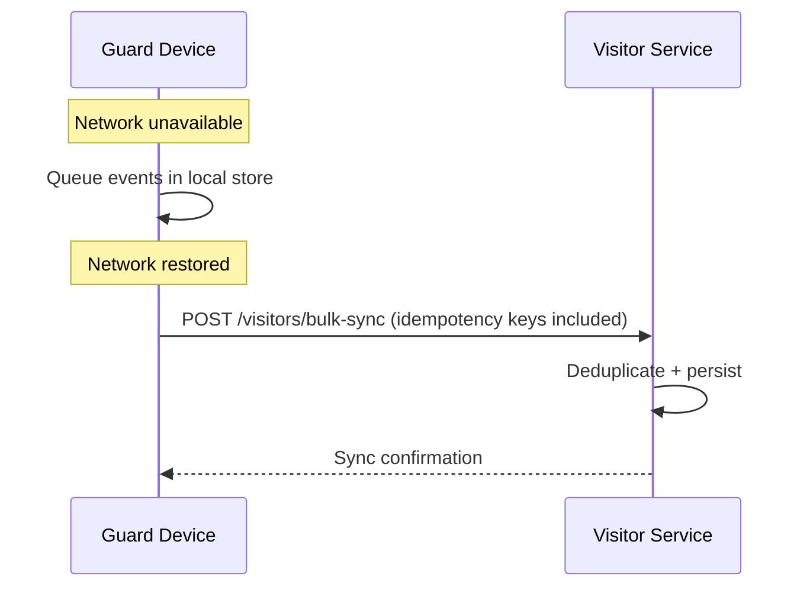

**Conflict resolution:** Server timestamps take precedence. Idempotency keys on each event prevent duplicates.

### 4.10 Notification Delivery Guarantees

**Semantics:** At-least-once delivery (push providers do not guarantee exactly-once).

**Deduplication on client:**

```
Each notification carries a stable notification_id.
Client ignores events with an already-processed ID.
```

**Retry pipeline:**

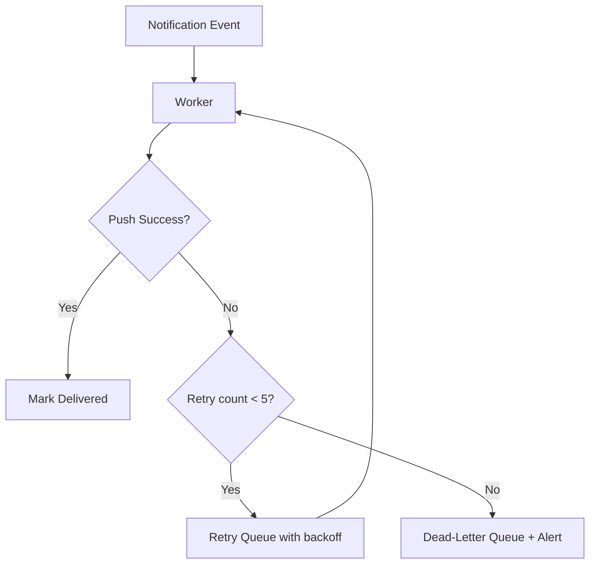

---

## Phase 5 — Scaling & Reliability

### 5.1 Scaling Strategy

- All API services are **stateless** — horizontally scalable behind a load balancer
- Kafka topics **partitioned by `society_id`** to ensure ordering within a society and parallel processing across societies
- Push workers scale independently based on queue lag (autoscaling trigger: lag > 10k messages)
- Redis cluster for approval cache with read replicas per region

### 5.2 Multi-Tenant Isolation

Every record carries `society_id` as a first-class field used for:

| Purpose | Mechanism |
|---|---|
| Data partitioning | Kafka partition key, DB shard key |
| Access control | JWT claims include `society_id`; enforced at API layer |
| Rate limiting | Per-society request quotas |
| Observability | Metrics tagged by `society_id` |

### 5.3 Peak Hour Handling

**Peak load scenarios:**

- Morning domestic help rush (8–10 AM)
- Lunchtime delivery spikes
- Festival/event days with guest surges

**Mitigations:**

- Kafka absorbs burst traffic; workers drain at their own pace
- Worker autoscaling triggered by consumer lag
- Approval cache pre-warmed for repeat visitors (domestic help, frequent guests)
- Push notification batching for non-urgent alerts (e.g., delivery logged after entry)

### 5.4 Authentication & Security

- **JWT tokens** issued by Auth Service; short-lived (15 min access, 7-day refresh)
- **Role-based access control:** guard | resident | society\_admin | platform\_admin
- Guard tokens scoped to `society_id` and `gate_id`
- Visitor photos stored in object storage (S3-compatible) with pre-signed URLs; not embedded in API responses
- All inter-service communication over mTLS
- Audit logs are append-only; deletion requires admin escalation

### 5.5 Observability

**Key metrics to track:**

| Metric | Alert Threshold |
|---|---|
| Notification end-to-end latency (P99) | > 3 seconds |
| Push delivery success rate | < 98% |
| Kafka consumer lag | > 10,000 messages |
| Approval cache hit rate | < 85% |
| Resident approval response time (P50) | > 30 seconds |

**Tooling:** Prometheus + Grafana for metrics; distributed tracing (Jaeger/OpenTelemetry) for request flows; structured logging with `society_id`, `flat_id`, `visitor_id` as trace fields.

---

## Phase 6 — Edge Cases & Tradeoffs

### 6.1 Edge Cases

**Resident does not respond**

- Configurable timeout (default: 2 minutes)
- Guard app shows escalation options: intercom call, contact society admin
- Entry logged as `timeout` in audit trail

**Duplicate visitor entries**

- Deduplicate on `(flat_id, visitor_name, created_at window of 5 min)`
- Idempotency key on Guard App submission prevents double-taps

**Push notification delayed by OS**

- Resident app polls `GET /notifications?since={ts}` on foreground resume
- Guard sees a spinner + timeout; can manually re-request notification

**Guard device offline**

- Local approval cache serves gate operations
- Events queued locally; bulk sync on reconnect
- Guard UI shows "Offline mode — using cached approvals" banner

**Resident with multiple devices**

- Notification fanned out to all registered device tokens for the resident
- First device to acknowledge → others receive a "already resolved" update

**Expired pre-approval used at gate**

- Approval Service checks `valid_till` before responding
- Guard App surfaces clear "Approval Expired" message with option to call resident

### 6.2 Tradeoffs

| Decision | Chosen Approach | Tradeoff |
|---|---|---|
| Async push via queue | High scalability, decoupled gate ops | Slight delivery delay vs synchronous push |
| Redis approval cache | Sub-millisecond gate lookup | Revoked approvals may be stale for up to 5 min |
| Eventual consistency | Faster UX, higher throughput | Audit logs may lag real-time by seconds |
| At-least-once delivery | Simpler retry logic | Client-side deduplication required |
| JWT (stateless auth) | No session store needed | Revocation requires short TTL or a token blocklist |
| Local guard cache | Offline resilience | Cache may be up to 15 min stale |

---

## Tech Stack Summary

| Layer | Technology | Reason |
|---|---|---|
| API Gateway | Kong / AWS API Gateway | Rate limiting, auth, routing |
| Backend Services | Go / Java (Spring Boot) | High throughput, low latency |
| Message Queue | Apache Kafka | Ordered, partitioned, durable |
| Push (Android) | Firebase Cloud Messaging (FCM) | Industry standard |
| Push (iOS) | Apple Push Notification Service (APNS) | Required for iOS |
| Real-time | WebSocket (via Socket.io / custom) | Active-user notification |
| Primary DB | PostgreSQL | Relational, ACID, audit logs |
| Cache | Redis Cluster | Approval cache, presence state |
| Object Storage | S3-compatible (AWS S3 / MinIO) | Visitor photos |
| Observability | Prometheus + Grafana + Jaeger | Metrics, dashboards, traces |

---

## Key Insights

- **Notification delivery is event-driven:** decoupling gate operations from push infrastructure is critical at scale
- **Pre-approvals reduce latency:** the common case (domestic help, regular guests) should never require a resident round-trip
- **Hybrid push + WebSocket:** push notifications wake the app; WebSockets provide real-time state sync for active users
- **Multi-tenant partitioning by `society_id`** ensures isolation, fair resource allocation, and efficient scaling
- **Offline resilience at the gate** is non-negotiable — guard operations cannot depend on internet availability

---

## Summary

| Capability | Design Choice |
|---|---|
| Real-time visitor notifications | Event-driven, Kafka-backed push pipeline |
| Pre-approval | Redis-cached, QR-pass supported |
| Guard resilience | Offline cache + local event queue |
| Scalability | Stateless services, partitioned queues, autoscaling workers |
| Reliability | At-least-once delivery, retry + DLQ, idempotency |
| Security | JWT RBAC, mTLS, signed QR tokens, append-only audit logs |
