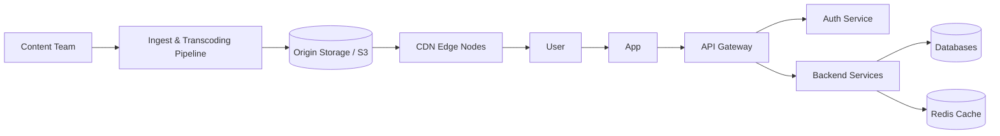
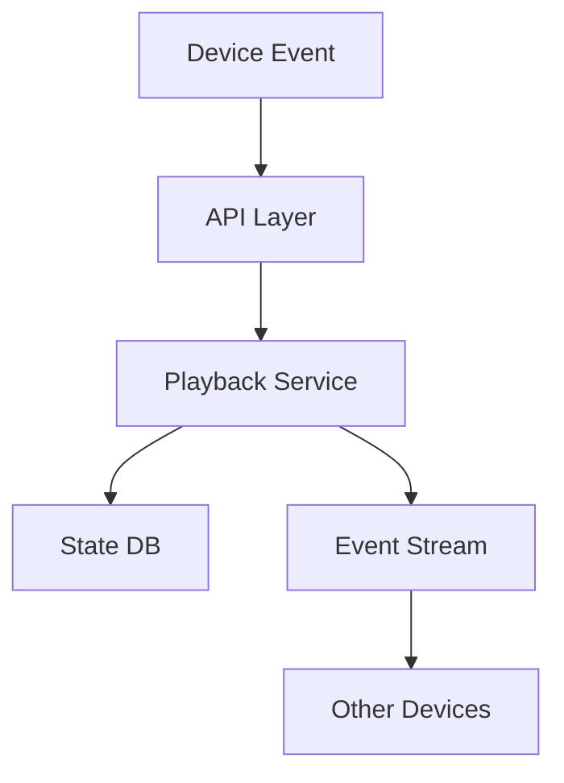
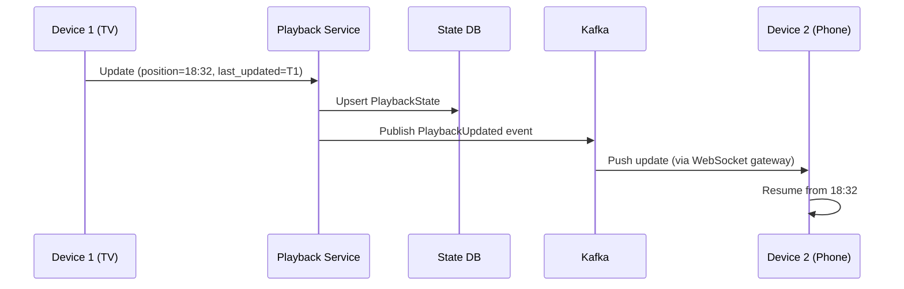
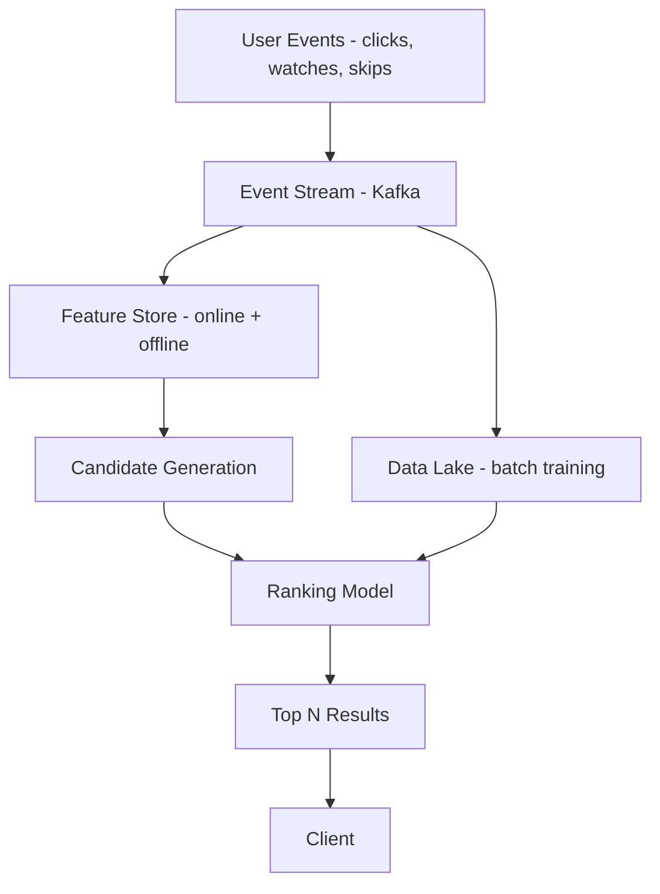
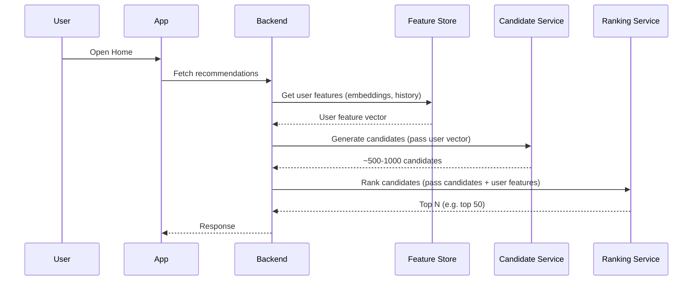
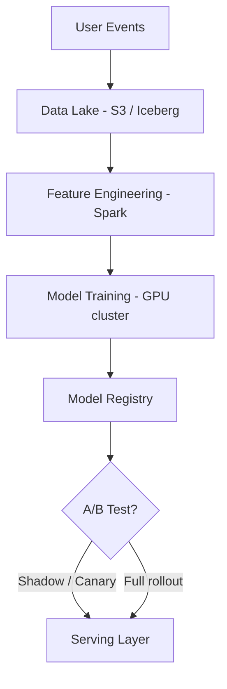
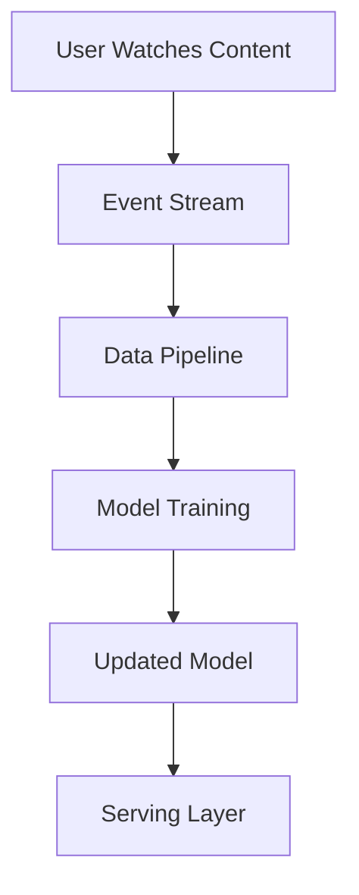
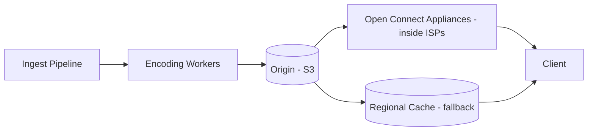
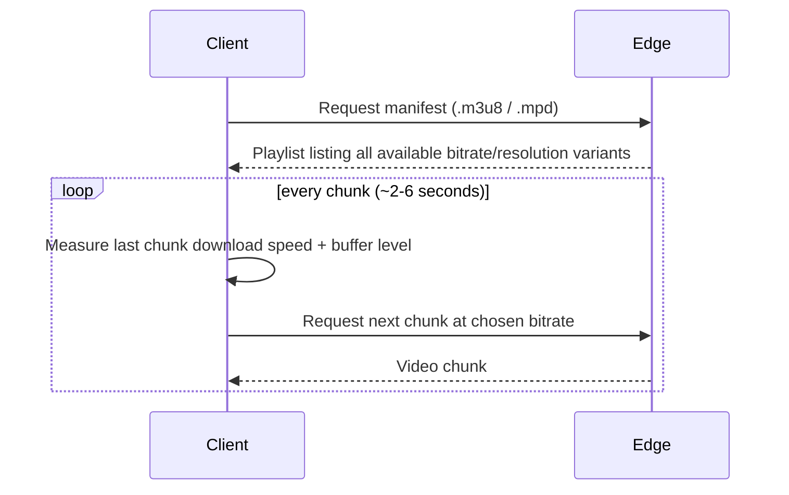
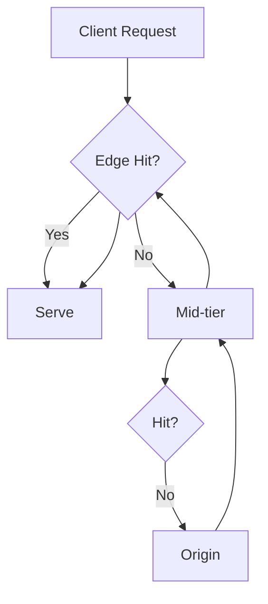

# 🎬 Netflix System Design (End-to-End)

> **Author:** Aditya Kumar Singh
> 
> **GitHub:** [facileWizard](https://github.com/facileWizard)


---

## 0. 📌 Assumptions

* Millions of concurrent users globally (~200M+ subscribers)
* Playback start latency < 2s
* Eventual consistency acceptable for sync state
* High availability (99.99%) — ~52 minutes downtime/year max
* Content catalog: ~15,000–17,000 titles globally (varies by region)
* Read-heavy system — browsing, searching, and streaming vastly outnumber writes
* Write pattern for sync: high-frequency small writes (~every 30–60s per active session)
* Peak traffic is bursty (evenings, new season drops) — must scale horizontally on demand
* Users expect seamless experience across devices: TV, mobile, browser, game console

---

## 0.5 Requirements

### Functional
- Stream video content
- Sync playback across devices
- Provide personalized recommendations
- Search and browse content

### Non-Functional
- Low startup latency (<2s)
- High availability (99.99%)
- Global scalability (millions of users)
- High throughput (CDN-heavy traffic)

---

## 🧭 Design Phases

This document is structured in phases for clarity and incremental depth:

```text
Phase 1 → HLD (Product view)
Phase 2 → Core Services
Phase 3 → Playback Sync (Deep Dive)
Phase 4 → Recommendations
Phase 5 → CDN + Storage
Phase 6 → Scaling + Edge Cases
```

---

# 🚀 Phase 1 — High-Level Architecture (HLD)



## End-to-End Flow (Simplified)

1. User opens app → request goes to API Gateway  
2. Backend services fetch metadata, auth, recommendations  
3. Playback Service returns signed CDN URL + DRM token  
4. Client streams video chunks directly from CDN  
5. Client sends playback events → Sync Service → stored + propagated
   

> **Note:** Video upload/ingest is a completely separate pipeline from playback. The backend services handle metadata and state; CDN serves the actual video bytes directly to the client — the backend does **not** proxy video traffic.

---

# ⚙️ Phase 2 — Core Services

Netflix uses microservices to enable independent scaling, fault isolation, and faster deployments.

* **API Gateway** — Single entry point, rate limiting, routing
* **Auth / Identity Service** — Login, OAuth, session tokens
* **User Service** — Profile, preferences, subscription status
* **Content Service** — Metadata (title, cast, genre, thumbnails)
* **Playback Service** — Stream URL resolution, DRM token issuance
* **Sync Service** — Cross-device playback position tracking
* **Recommendation Service** — Personalized content ranking
* **Search Service** — Full-text and faceted search over content catalog
* **Notification Service** — Push/email alerts (new episodes, etc.)
* **Ingest & Transcoding Service** — Encodes uploaded video into multiple formats/resolutions
* **Billing / Subscription Service** — Plan management, payment processing

> **Note:** Playback Service does **not** serve video bytes — it issues a signed CDN URL or DRM license. The client fetches video chunks directly from the CDN.

---

# 🔥 Phase 3 — Playback Sync (DEEP DIVE)

## 3.1 🧠 Problem

User watches content on one device and continues on another.

```text
TV → watched till 18:32
Phone → should resume from ~18:32
```

---

## 3.2 🏗️ Core Idea

```text
Device → emit playback events → backend → store → propagate
```

---

## 3.3 📡 Event-Based Architecture



---

## 3.4 📦 Data Model

```plaintext
PlaybackState {
  user_id       — account identifier
  profile_id    — Netflix supports multiple profiles per account
  content_id    — show/movie ID
  episode_id    — for series (null for movies)
  position_sec  — playback offset in seconds (the actual resume point)
  duration_sec  — total content duration (to compute % watched)
  device_id     — identifies originating device
  session_id    — unique per playback session
  last_updated  — UTC timestamp for conflict resolution
}
```

> **Gap fix:** `timestamp` in the original was ambiguous — it could mean wall-clock time or playback position. These are two different fields: `position_sec` (where in the video) and `last_updated` (when it was recorded). Conflating them is a common design mistake.

---

## 3.5 🔄 Sync Flow



---

## 3.6 ⚠️ Conflict Resolution

### Scenario

```text
Device A (offline for 10 min) → position 10:00, last_updated = T1
Device B (active)             → position 18:32, last_updated = T2  (T2 > T1)
```

### Strategy

```text
Latest last_updated timestamp wins → resume from 18:32
```

### Why this works
The user was most recently on Device B, so its position is the most current. Resuming from there is the right UX choice.

### ⚠️ Clock Skew Problem
Devices have local clocks that may drift or be incorrectly set. **Always use server-assigned timestamps**, not client-reported ones, as the authoritative `last_updated` value. The server stamps the event on receipt.

### Edge Handling

* **Backward jump guard** — if new position < current position by more than a threshold (e.g. 60s), treat as a scrub/rewind, not a stale update
* **Device priority (optional)** — TV > mobile as a tiebreaker when timestamps are within a small window (e.g. < 2s apart)
* **Completed content** — if a device reports 100% completion, that state should never be overwritten by a lower-position update from another device

---

## 3.7 🔁 Push vs Pull

### Push (preferred)

* **WebSocket** — persistent bidirectional connection; server pushes updates to the client immediately
* **SSE (Server-Sent Events)** — unidirectional, simpler than WebSocket; sufficient for sync since updates only flow server → client
* Near real-time update

**Scaling WebSocket/SSE at Netflix scale:**
* Backend services are stateless — they don't maintain socket connections themselves
* A dedicated **WebSocket Gateway** layer holds persistent connections
* When Kafka emits a `PlaybackUpdated` event, the gateway fans it out to all connected devices for that user
* Connections are partitioned by `user_id` to route events to the right gateway node

### Pull (fallback)

* On app open — always fetch latest state before rendering the UI
* Periodic polling as a safety net if the push connection drops
* Fetch latest state from the Sync Service directly

---

## 3.8 📴 Offline Handling

```text
Device offline → local cache
→ reconnect → sync latest state
```

Conflict handled using timestamp comparison.

---

## 3.9 ⚡ Consistency Model

```text
Eventual consistency (few seconds delay acceptable)
```

**Why eventual consistency is safe here:**
* A few seconds of sync lag is imperceptible to users
* The cost of strong consistency (distributed locks, synchronous cross-region writes) would kill latency
* Worst case: user resumes a few seconds off — trivially correctable

**What would require stronger consistency:**
* Billing / entitlement checks (must be consistent — can't let expired users stream)
* DRM license issuance (should not serve to unauthorised sessions)

---

## 3.10 📊 Scaling

* **Partition by user_id** — ensures all profile/device state for a user hits the same shard
* **Cache recent playback in Redis** — TTL of a few hours covers active sessions; avoids DB reads on every sync
* **Use Kafka for propagation** — decouples the Playback Service from downstream consumers (sync gateway, analytics)
* **DB choice** — Cassandra is a natural fit: optimised for high write throughput, partitions well by user_id, supports upsert semantics needed for conflict-free state updates
* **Write frequency** — clients emit heartbeats every ~30–60 seconds during active playback; at 10M concurrent viewers that's ~150K–300K writes/sec — requires a write-optimised store, not a relational DB
* **Data retention** — playback state for completed content can be archived after 90 days; active/in-progress state is hot and kept in Redis + Cassandra

---

## 3.11 💡 Key Insight

```text
Netflix syncs STATE, not VIDEO
```

---

# 🧠 Phase 4 — Recommendation System (DEEP DIVE)

## 4.1 🧠 Problem

Recommend personalized content for each user in real-time while handling massive scale.

---

## 4.2 🏗️ High-Level Pipeline



> **Gap fix:** User events don't flow directly into the Feature Store as a static snapshot — they continuously stream through Kafka, updating both the online Feature Store (real-time features) and the offline Data Lake (used for batch model retraining).

---

## 4.3 🔄 Two-Stage Architecture (CRITICAL)

### Stage 1: Candidate Generation

Goal:

```text
Reduce millions of videos → ~500–1000 candidates
```

Techniques:

* **Embedding-based retrieval** — User and content are embedded into the same vector space; ANN search finds nearest content vectors (this is the dominant technique at Netflix scale)
* **Matrix factorization** — Decomposes the user-item interaction matrix into latent factors
* Collaborative filtering (users with similar taste)
* Content-based filtering (same genre, actors)
* Trending / popular content
* Recently watched / continue watching

> **Gap fix:** The original said "few hundred" — in practice at Netflix scale, candidate generation produces ~500–1000 items to give the ranker enough signal. Too few and you lose recall; too many and ranking latency blows up. Also, embedding/ANN retrieval is the primary technique, not just collaborative filtering.

---

### Stage 2: Ranking

Goal:

```text
Rank candidates based on probability user will engage
```

**Model type:** Typically a neural network (deep learning) or gradient boosted trees (e.g. XGBoost). Netflix uses a **two-tower neural network** architecture where user and item embeddings are scored together.

Signals:

* Watch history and completion rate
* Click-through rate (CTR) on similar content
* Watch time / session length
* Time of day / device type
* Freshness and recency of content
* Explicit ratings / thumbs up-down

**Post-ranking — Business Rules Layer:**
Raw model scores aren't served directly. A rules layer applies overrides:
* Boost new original Netflix content
* Suppress content the user already finished
* Enforce content licensing restrictions by region
* Diversity injection — avoid 10 consecutive thrillers

> **Gap fix:** The original implied ranking is purely ML. In production, a business rules / re-ranking layer always sits on top of the model to satisfy content, legal, and UX constraints.

---

## 4.4 📦 Online Serving Flow



> **Gap fix:** The original showed Backend calling CG and R as parallel/independent steps. In reality, candidates must be generated first, then passed to the ranker. The user feature vector fetched from the Feature Store is passed into both CG and R — they don't independently re-fetch it.

---

## 4.5 🧠 Feature Store (VERY IMPORTANT)

Stores:

```text
User features:
  - watch history
  - preferences
  - embeddings

Content features:
  - genre
  - popularity
  - embeddings
```

👉 Shared between:

* Offline training
* Online inference

---

## 4.6 ⚡ Real-Time vs Batch

### Batch (Offline Pipeline)



* **Data Lake** — raw events land in S3, queryable via Spark/Iceberg
* **Feature Engineering** — aggregate raw events into training features (e.g. "user watched 80%+ of 5 action films this week")
* **Model Training** — runs on GPU clusters, typically daily or weekly
* **Model Registry** — versioned store of trained models; enables rollback if a new model degrades metrics
* **A/B Testing** — new models are shadow-tested or canary-deployed to a % of users before full rollout; Netflix runs hundreds of A/B experiments simultaneously

---

### Real-Time (Online Serving)

* Fetch latest features from online Feature Store (low-latency key-value lookup)
* Apply trained model loaded from Model Registry
* Target latency: **<100ms** end-to-end for the full recommendation response

---

## 4.7 ❄️ Cold Start Problem

### New User

* Show trending and globally popular content
* Onboarding preferences questionnaire (genre/mood picks)
* Use demographic/location signals as weak proxy

### New Content

* **Content-based bootstrapping** — generate embeddings from metadata (genre, cast, synopsis, director) before any user interaction exists
* Surface to a small % of users (exploration traffic) to gather early signals
* Once enough interactions accumulate, collaborative signals take over

> **Gap fix:** The original said "randomly surfacing" — this is risky at scale (wastes impressions, hurts CTR). Real systems use metadata-derived embeddings to make an educated initial placement, not random exposure.

---

## 4.8 🔁 Feedback Loop



👉 Continuous improvement cycle

---

## 4.9 📊 Scaling

* Cache recommendations (Redis)
* Precompute top-N for active users
* Partition by user_id
* Use approximate nearest neighbor (ANN) for fast retrieval

---

## 4.10 ⚠️ Challenges

* **Feedback loop / echo chamber bias** — the model recommends what users already like, starving new or niche content of impressions; mitigated by deliberate exploration (epsilon-greedy or contextual bandits)
* **Latency vs accuracy tradeoff** — more complex models are more accurate but slower; must stay under 100ms total; addressed by precomputing and caching recommendations for active users
* **Freshness vs relevance** — a model trained on last week's data may miss a user's recent taste shift; near-real-time feature updates (streaming feature pipeline) help bridge the gap
* **Position bias** — items shown at the top of the screen get more clicks regardless of quality; must be corrected for during training (propensity weighting)
* **Implicit vs explicit signals** — a user finishing a movie could mean they loved it or couldn't find the remote; Netflix weighs completion rate, re-watches, and ratings together to infer true preference

---

## 4.11 💡 Key Insight

```text
Recommendation = Candidate Generation (recall) + Ranking (precision)
```

---

# 🌐 Phase 5 — Content Delivery (CDN DEEP DIVE)

## 5.1 🧠 Problem

Stream high-quality video globally with low startup latency and minimal buffering.

---

## 5.2 🏗️ Delivery Architecture



* **Origin (S3)** — master store for all encoded video chunks; never directly hit by end users at scale
* **Open Connect Appliances (OCA)** — Netflix's proprietary CDN hardware deployed directly inside ISP data centers; serves the vast majority of Netflix traffic; ISPs host them for free in exchange for reduced upstream bandwidth costs
* **Mid-tier / Regional Cache** — fallback for regions where Open Connect isn't deployed; also acts as a shield between OCAs and Origin on cache misses
* **Client** — fetches chunks directly from the nearest OCA; never talks to Origin

> **Key insight:** Netflix's CDN strategy (Open Connect) is what makes 15%+ of peak internet traffic globally feasible. By co-locating inside ISPs, last-mile latency is minimised and Netflix avoids paying for transit bandwidth.

---

## 5.3 📦 Video Packaging (HLS/DASH)

**Step 1 — Transcoding (happens at ingest time, not at request time):**
* Raw uploaded video is encoded into multiple resolutions and bitrates
* Netflix uses multiple codecs: H.264, H.265/HEVC, AV1 (for bandwidth efficiency)
* A single title may produce **100+ encoded variants** (resolution × bitrate × codec combinations)

**Step 2 — Packaging:**
* Each encoded variant is split into **small chunks (2–6 seconds)**
* A manifest file (playlist) lists all available variants

```text
4K HDR (AV1), 1080p, 720p, 480p, 360p ... → each segmented into chunks
```

Protocols:

* **HLS (HTTP Live Streaming)** — dominant on Apple/iOS
* **MPEG-DASH** — dominant on Android, Smart TVs, Web

> **Gap fix:** The original implies packaging happens at stream time. In reality, all encoding and chunking is done **offline at ingest** and stored on Origin (S3). At playback, clients just fetch pre-built chunks. Also, Netflix operates its own CDN called **Open Connect**, deployed directly inside ISP networks — not a third-party CDN.

---

## 5.4 🎚️ Adaptive Bitrate (ABR)

Client dynamically selects bitrate based on:

* Network bandwidth (measured via throughput of previous chunk download)
* Buffer health (how many seconds are pre-buffered)
* Device capability (screen resolution, hardware decoder support)



**ABR algorithm** — the client player runs a local algorithm (e.g. buffer-based or throughput-based) to decide when to step up or step down quality. This decision is made **entirely on the client** — the server just serves whatever chunk is requested.

👉 Ensures smooth playback with minimal buffering

---

## 5.5 🔐 DRM (Digital Rights Management)

Netflix must enforce content licensing — video chunks cannot be played by just anyone who fetches them from the CDN.

```text
Client → requests DRM license from License Server (not CDN)
License Server → validates subscription/entitlement → issues decryption key
Client → decrypts chunks locally and renders video
```

DRM systems used:
* **Widevine** (Google) — Android, Chrome, Smart TVs
* **FairPlay** (Apple) — iOS, Safari, Apple TV
* **PlayReady** (Microsoft) — Windows, Xbox

> **Key insight:** Video chunks on the CDN are **encrypted**. Without a valid license key, a downloaded chunk is useless. This is how Netflix prevents piracy even if someone intercepts CDN traffic.

---

## 5.6 ⚡ Startup Latency Optimization

* **Pre-fetch initial chunks** — the client requests the first 2–3 chunks before the user even presses play (e.g. while browsing the title screen), so playback starts from buffer, not from a cold request
* **Warm popular content at edge** — new episode drops or trending content is proactively pushed to OCAs before user demand spikes, not reactively cached on first miss
* **Anycast / geo-DNS routing** — the client's DNS query resolves to the IP of the nearest OCA; Netflix's steering service continuously measures OCA health and load to pick the optimal node
* **Manifest pre-fetch** — the `.m3u8` / `.mpd` manifest is fetched eagerly when a user hovers over a title, cutting perceived startup time
* **Low-quality thumbnail stream first** — some clients start playback at a low bitrate instantly, then ramp up — perceived start time is < 1s even on slow connections

---

## 5.7 🗄️ Caching Strategy

* **Hot content cached at edge** — top ~20% of titles drive ~80%+ of traffic (power law); these always stay warm
* **Eviction policy** — not pure LRU; OCAs use a **popularity-weighted LRU** that factors in both recency of access and request frequency, so a viral title isn't evicted just because it wasn't hit in the last hour
* **Cache key** — `content_id + resolution + bitrate + codec + chunk_index` — must be fully qualified; two clients requesting 1080p H.264 chunk #42 of the same show share the same cached object
* **TTL** — video chunks are immutable (a chunk never changes after encoding), so TTL can be very long (days/weeks); manifests have shorter TTL since they can update (e.g. new audio track added)
* **Cache fill strategy** — popular new releases are **pushed** to OCAs proactively (fill); niche content is filled **on first miss** (pull)

---

## 5.8 🔁 Cache Miss Flow



---

## 5.9 📊 Scaling

* CDN handles majority of traffic
* Origin protected via multi-layer caching
* Global PoPs (points of presence)

---

## 5.10 💡 Key Insight

```text
Video streaming is bandwidth-heavy → push data closer to user (CDN)
```

---

# 📊 Phase 6 — Scaling + Edge Cases (DEEP DIVE)

## 6.1 🏗️ Horizontal Scaling

**Backend services:**
* Stateless — no session state stored in-process; all state in DB/cache
* Auto-scaling groups (AWS ASG) — scale out during peak (evening hours, new season drops), scale in overnight
* Load balancers distribute traffic (Netflix uses AWS ELB + internal service mesh via **Envoy** sidecar proxies)

**Database scaling:**
* Primary + read replicas — most traffic is read-heavy; replicas serve reads and protect primary
* Connection pooling — each service maintains a pool of DB connections; avoids connection exhaustion at scale
* Cassandra (for Playback/Sync) — natively distributed, no single primary; scales writes horizontally by adding nodes

**Microservices isolation:**
* Each service is independently deployable and scalable
* Netflix uses **Hystrix** (now replaced by Resilience4j) for circuit breaking between services

---

## 6.2 📡 Event-Driven Backbone

**Event types streamed via Kafka:**
* Playback events (play, pause, seek, stop, heartbeat)
* Watch history updates
* UI interactions (clicks, impressions, hover time)
* Error and quality events (buffering, bitrate switches)

**Kafka topic design:**
* Topics partitioned by `user_id` — ensures all events for a user land on the same partition (ordering guarantee)
* Separate topics per event type — allows independent consumer scaling

**Consumer groups (each independently processes the stream):**
* Sync Service — updates PlaybackState in Cassandra
* Recommendation pipeline — feeds Feature Store for near-real-time feature updates
* Analytics / Data Lake — writes raw events to S3 for batch processing
* Monitoring / alerting — detects playback error spikes in real time

---

## 6.3 🧠 Partitioning Strategy

* **user_id-based sharding** — for PlaybackState, user preferences, recommendations
* **content_id-based sharding** — for content metadata, view counts, popularity scores
* **Time-based partitioning** — for event streams (Kafka topics partitioned by time window) to support efficient replay and analytics queries
* **Geographic partitioning** — CDN edge nodes serve regionally; databases may have regional replicas to reduce cross-region read latency

---

## 6.4 ⚠️ Edge Cases

### 1. Multiple Devices Conflict
* Compare `last_updated` server-stamped timestamps
* Highest timestamp wins; apply backward jump guard (see 3.6)

### 2. Network Fluctuation During Playback
* ABR algorithm detects falling throughput → steps down to a lower bitrate chunk
* Client pre-buffer absorbs short outages (up to ~30s of buffered video)
* On complete disconnect: playback pauses; on reconnect, player resumes from buffered position

### 3. Offline Device
* Downloads stored locally in encrypted form (with time-limited DRM license)
* On reconnect: sync position to server; DRM license validity checked before playback resumes

### 4. Partial / Checkpoint-Based Sync
* Heartbeat sent every ~30–60s, not every second — reduces write load by ~30–60x
* On abrupt app kill (crash, force close): last checkpoint position is used; user may lose a few seconds

### 5. Concurrent Stream Limit (Missing from original)
* Netflix plans limit simultaneous streams (e.g. Standard = 2 screens, Premium = 4)
* Enforced at the **DRM license issuance layer** — the License Server checks active session count before issuing a key
* Prevents account sharing beyond plan limits

### 6. CDN Node Failure
* Client detects failed chunk download → retries on same OCA → if still failing, re-requests a new OCA address from Netflix's steering service
* Transparent to user if fallback completes within the buffer window

---

## 6.5 🔁 Retry & Resilience

* **Exponential backoff with jitter** — retries don't all fire at the same time (avoids thundering herd); jitter randomises the retry delay
* **Idempotent writes** — sync/state updates must be idempotent; retrying the same heartbeat shouldn't create duplicate records (upsert by `user_id + content_id + session_id`)
* **Circuit breakers** — if Recommendation Service is down, the API Gateway returns cached/default recommendations instead of failing the home screen load entirely
* **Graceful degradation ladder:**
  1. Full personalised recommendations → cached recommendations → trending/popular fallback → empty shelf hidden
  2. HD video → lower bitrate → audio-only mode (extreme fallback)
  3. Sync active → sync on reconnect → local state only
* **Timeout budgets** — each service call has a strict timeout; no call waits indefinitely (prevents cascading thread pool exhaustion)

---

## 6.6 📉 Hotspot Handling

* **Viral content / new season drops → pre-warm caches** — Netflix's content team knows release schedules; OCAs are filled proactively hours before launch
* **Regional replication** — popular content duplicated across all OCAs in affected regions, not just one
* **Request coalescing** — if 1,000 users simultaneously request the same uncached chunk (thundering herd on cache miss), the OCA issues **one** upstream fetch and holds the other 999 requests until it returns, then serves all from the single response. This prevents 1,000 simultaneous origin hits.
* **Rate limiting at edge** — protects Origin from being overwhelmed even during coalescing failures
* **Thundering herd on new deployments** — when a service restarts, its local cache is cold; use a **cache warming** step in the deployment runbook before shifting traffic

---

## 6.7 🔐 Reliability

* **Multi-region deployment** — Netflix runs in multiple AWS regions (e.g. us-east-1, eu-west-1, ap-southeast-1)
* **Active-active setup** — all regions serve live traffic simultaneously; no region is purely a standby
* **Failover routing** — DNS/load balancer routes away from degraded regions automatically
* **Chaos Engineering** — Netflix pioneered "Chaos Monkey" (deliberately kills production instances) to verify resilience
* **Bulkhead pattern** — services are isolated so a failure in Recommendations doesn't cascade to Playback

---

## 6.8 💡 Key Insight

```text
Netflix optimizes for availability and latency over strict consistency
```

---

## Tradeoffs

| Decision | Tradeoff |
|--------|--------|
CDN (Open Connect) | Higher infra cost vs ultra-low latency |
Microservices | Operational complexity vs scalability & isolation |
Caching (Redis/CDN) | Stale data vs performance |
Eventual consistency (sync/recs) | Slight inconsistency vs low latency |
Precompute recommendations | Storage + compute vs fast response time |

---

# 🚀 Summary

* **Event-driven + CDN-heavy architecture** — video bytes served by CDN (Open Connect), not backend
* **Playback sync via state propagation** — syncs position, not video; eventual consistency via Kafka
* **Two-stage recommendation pipeline** — candidate generation (recall via ANN/embeddings) + ranking (precision via ML model)
* **Offline ingest pipeline** — transcoding into 100+ variants at upload time, not at stream time
* **Adaptive bitrate streaming** — client-side algorithm picks chunk quality based on buffer + bandwidth
* **DRM enforced at license layer** — encrypted chunks + per-session license keys (Widevine / FairPlay / PlayReady)
* **Cold start solved by metadata embeddings** — not random surfacing
* **Chaos Engineering for resilience** — active-active multi-region with deliberate fault injection
* **Consistency is context-dependent** — eventual for sync/recommendations, strong for billing/entitlement
