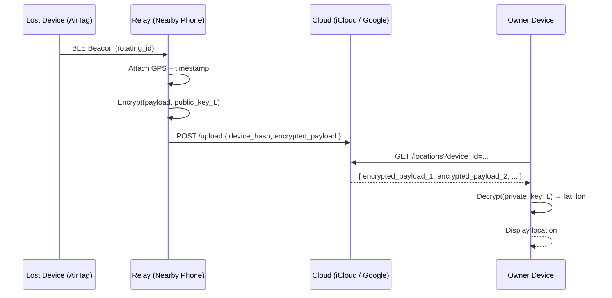
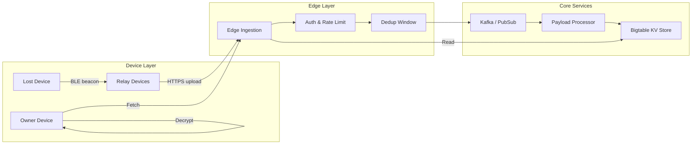
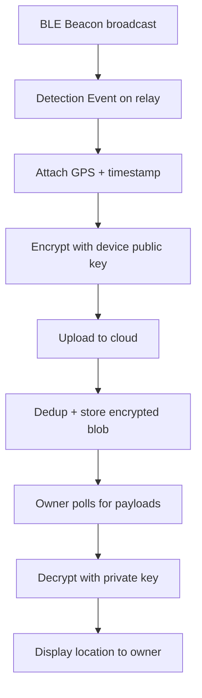
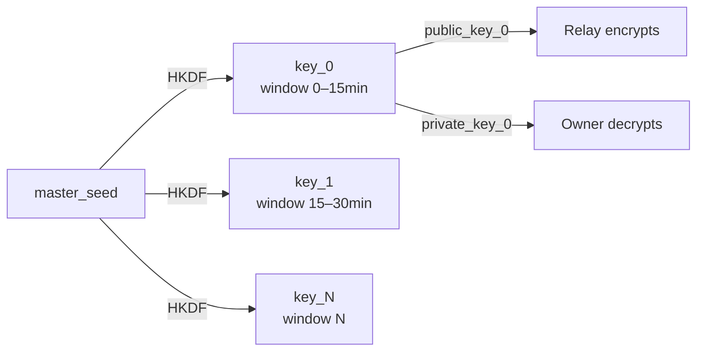

# Find My Network — Complete System Design (Apple & Google)

> A crowdsourced, privacy-preserving distributed system that locates lost devices even when they are offline.

---

## Table of Contents

1. [Overview](#1-overview)
2. [Problem Statement & Constraints](#2-problem-statement--constraints)
3. [High-Level Architecture](#3-high-level-architecture)
4. [End-to-End Flow](#4-end-to-end-flow)
5. [Low-Level Design](#5-low-level-design)
6. [Cryptography Design](#6-cryptography-design)
7. [Event-Driven Architecture](#7-event-driven-architecture)
8. [Deduplication Logic](#8-deduplication-logic)
9. [Scaling Architecture](#9-scaling-architecture)
10. [Performance Budget](#10-performance-budget)
11. [Security & Privacy](#11-security--privacy)
12. [Consistency Model](#12-consistency-model)
13. [Failure Handling](#13-failure-handling)
14. [Edge Cases](#14-edge-cases)
15. [Anti-Stalking System](#15-anti-stalking-system)
16. [Apple vs Google Comparison](#16-apple-vs-google-comparison)
17. [Trade-offs & Design Decisions](#17-trade-offs--design-decisions)
18. [Advanced Enhancements](#18-advanced-enhancements)
19. [How to Present in Interviews](#19-how-to-present-in-interviews)
20. [Extensions](#20-extensions)

---

## 1. Overview

The **Find My** network leverages four core primitives:

| Primitive | Role |
|---|---|
| Bluetooth Low Energy (BLE) | Discovery beacon broadcast by lost device |
| Billions of relay devices | Crowdsourced location upload without consent/awareness |
| End-to-end encryption | Zero-knowledge for server and relay — only owner can decrypt |
| Distributed cloud storage | Global, low-latency payload store keyed by device hash |

---

## 2. Problem Statement & Constraints

### Functional Requirements
- Locate a lost device even when it has no internet connectivity
- Report location within 1–3 seconds of a relay detecting the beacon
- Work globally across iOS, Android, macOS, Windows

### Non-Functional Requirements
- **Privacy:** Server and relay devices must learn nothing about the owner or location
- **Scale:** Billions of BLE signals per day (~550K writes/sec at peak)
- **Latency:** End-to-end location update < 3 seconds
- **Availability:** 99.99% uptime for the fetch path

### Out of Scope
- Real-time tracking (this is a polling system, not a stream)
- Precise indoor positioning (GPS-limited; see [Advanced Enhancements](#18-advanced-enhancements))

---

## 3. High-Level Architecture

```
┌─────────────────────────────────────────────────────────────┐
│                        DEVICE LAYER                         │
│                                                             │
│   [Lost Device]  ──BLE──▶  [Relay Device]   [Owner Device] │
│   rotating beacon           encrypt+GPS         fetch+decrypt│
└───────────────────────────────┬─────────────────────┬───────┘
                                │ HTTPS upload        │ HTTPS fetch
                                ▼                     ▼
┌─────────────────────────────────────────────────────────────┐
│                         EDGE LAYER                          │
│                                                             │
│         [Auth & Rate Limit]    [Dedup Window]               │
└───────────────────────────────┬─────────────────────────────┘
                                │
                                ▼
┌─────────────────────────────────────────────────────────────┐
│                         CORE LAYER                          │
│                                                             │
│      [Message Queue]  ──▶  [Payload Processor]             │
│      Kafka / PubSub                 │                        │
│                                     ▼                        │
│                        [Distributed KV Store]               │
│                         Bigtable / Spanner                  │
└─────────────────────────────────────────────────────────────┘
```

---

## 4. End-to-End Flow

### Sequence Diagram

```
Lost Device (AirTag)      Relay (Nearby Phone)    Cloud (iCloud)    Owner Device
       │                         │                      │                 │
       │──── BLE Beacon ────────▶│                      │                 │
       │     (rotating_id)       │                      │                 │
       │                         │─ Attach GPS + ts ──▶ │                 │
       │                         │─ Encrypt(loc, pub_key_L) ──────────────│
       │                         │──── POST /upload ──▶│                  │
       │                         │                      │                 │
       │                         │                      │◀── GET /locations?device_id
       │                         │                      │─── encrypted payloads ──▶│
       │                         │                      │                 │
       │                         │                      │         Decrypt(priv_key_L)
       │                         │                      │                 │
       │                         │                      │         Show location ✓
```

### Step-by-Step

1. **Lost device** broadcasts a BLE beacon containing a `rotating_id` derived from its public key. The beacon rotates every ~15 minutes.
2. **Relay device** detects the beacon, attaches its own GPS coordinates and a timestamp, then encrypts the bundle using the lost device's public key.
3. **Relay device** uploads the encrypted payload to cloud via `POST /upload`. It cannot read what it uploaded.
4. **Owner device** polls `GET /locations?device_id=...`, receives encrypted blobs, and decrypts using the private key stored only on the owner's device.
5. Location is displayed to the owner. No intermediate party ever sees plaintext location.

---

## 5. Low-Level Design

### Data Models

```typescript
// Registered device identity
Device {
  device_id:   UUID         // stable internal ID
  public_key:  bytes        // used by relays to encrypt
  private_key: bytes        // stored ONLY on owner device, never uploaded
  master_seed: bytes        // used to derive rotating key schedule
}

// BLE payload broadcast by lost device
Beacon {
  rotating_id: bytes        // derived from master_seed + time_window
  timestamp:   unix_ms
}

// What the relay uploads
EncryptedPayload {
  device_hash:        string  // SHA-256(rotating_id) — server index key
  encrypted_location: bytes   // Encrypt(lat+lon+accuracy+ts, public_key)
  relay_timestamp:    unix_ms
  ttl:                unix_ms // payload expires after 7 days
}
```

> **Why `device_hash` and not `rotating_id` directly?**
> The server indexes by hash so it never sees the actual rotating identifier. This prevents the server from correlating uploads across time windows even if it wanted to.

### APIs

**Upload (relay → cloud)**
```
POST /v1/upload
Content-Type: application/json

{
  "device_hash":        "sha256_hex",
  "encrypted_payload":  "base64_bytes",
  "relay_timestamp":    1712300000000
}

Response: 202 Accepted
```

**Fetch (owner → cloud)**
```
GET /v1/locations?device_id={id}&since={unix_ms}

Response: {
  "payloads": [
    { "encrypted_payload": "base64_bytes", "relay_timestamp": 1712300000000 }
  ]
}
```

The server returns all encrypted blobs for the device. The owner device tries each blob with each key in its derived key schedule until decryption succeeds.

---

## 6. Cryptography Design

### Key Derivation & Rotation

The cryptographic scheme is the core privacy guarantee. It works as follows:

```
master_seed  ──HKDF──▶  key_0  (window 0, valid 15 min)
                    ──▶  key_1  (window 1, valid 15 min)
                    ──▶  key_N  (window N, valid 15 min)
                    
Each key_N = (public_key_N, private_key_N)
```

- The **lost device** broadcasts `rotating_id = f(public_key_N)` based on the current time window.
- The **relay** encrypts using `public_key_N`.
- The **owner device** knows `master_seed`, so it can reconstruct the full key schedule and try all keys to decrypt any payload — without ever uploading the private keys.

### Encryption

```
// Relay encrypts
ciphertext = ECIES_Encrypt(plaintext: lat||lon||accuracy||ts, key: public_key_N)

// Owner decrypts
plaintext  = ECIES_Decrypt(ciphertext, private_key_N)
```

### Guarantees

| Party | Can read location? | Why |
|---|---|---|
| Relay device | ❌ No | Only has `public_key_N`; encryption is one-way |
| Cloud server | ❌ No | Stores only `encrypted_payload`; never holds private key |
| Owner device | ✅ Yes | Has `master_seed` → derives `private_key_N` |
| Eavesdropper | ❌ No | `rotating_id` rotates; no stable identifier to track |

---

## 7. Event-Driven Architecture

The system is **hybrid** — combining continuous BLE signals with event-triggered uploads.

```
[BLE Beacon every 2s]
        │
        ▼
[Detection Event on relay]
        │
        ├──▶ Attach GPS + timestamp
        ├──▶ Encrypt payload
        └──▶ Upload to cloud  ──▶  [Kafka topic: location.uploads]
                                            │
                                            ▼
                                   [Payload Processor]
                                            │
                                   ┌────────┴────────┐
                                   ▼                  ▼
                             [Dedup check]      [Write to KV]
```

- BLE runs **continuously** (every 2 seconds) regardless of network state.
- Upload is **event-triggered**: each detection by a relay fires one upload attempt.
- Kafka decouples ingestion from storage, enabling burst absorption and replay.

---

## 8. Deduplication Logic

**Problem:** Multiple relay devices in the same area will all detect the same beacon and upload duplicate payloads for the same time window.

**Solution:** Deduplicate server-side on a sliding time window.

```
Group by:  (device_hash, time_window_bucket)   // e.g. 30-second buckets
Select:    payload with highest GPS accuracy
           if tie → take latest relay_timestamp
Discard:   remaining duplicates
```

**Enhancement — keep top-N by confidence:**
Rather than discarding all but one, retain the top 3 payloads by accuracy score. The owner device can average them or pick the best. This reduces impact of a single bad GPS reading.

**Time window size trade-off:**
- Smaller window → less dedup, more storage cost
- Larger window → more aggressive dedup, risk of dropping genuinely separate sightings

Recommended: 30-second buckets with a 7-day TTL on all stored payloads.

---

## 9. Scaling Architecture

### Back-of-Envelope

```
Assumptions:
  - 2B active relay devices worldwide
  - Each device detects ~1 lost beacon per 30 minutes on average
  - Payload size: ~200 bytes encrypted

Writes/sec = 2,000,000,000 / 1800 ≈ 1,100,000 writes/sec (peak)
After dedup  ≈ 550,000 writes/sec stored

Storage/day = 550K/s × 200B × 86,400s ≈ ~9.5 TB/day
With 7-day TTL ≈ ~67 TB hot storage
```

This rules out single-node databases and justifies Bigtable / Spanner.

### Infrastructure

```
                    [Global Load Balancer]
                           │
              ┌────────────┼────────────┐
              ▼            ▼            ▼
         [Edge PoP]   [Edge PoP]   [Edge PoP]   (CDN-edge ingestion)
              │
              ▼
    [Auth & Rate Limiting]   ← per-IP + per-device limits
              │
              ▼
    [Kafka / Cloud PubSub]   ← absorbs burst, enables replay
              │
              ▼
    [Payload Processor Fleet]  ← stateless, horizontally scalable
              │
              ▼
    [Distributed KV Store]   ← Bigtable (row key: device_hash#ts)
```

### Key Design Decisions

- **Push computation to edge:** Encryption and GPS attachment happen on the relay device, not in the cloud. This offloads the heaviest per-payload work.
- **Stateless backend:** Every service tier (edge, processor) is stateless. State lives only in Kafka and Bigtable.
- **Row key design:** `device_hash#timestamp` enables efficient range scans when the owner fetches all recent payloads for a device.

---

## 10. Performance Budget

| Stage | Target | Notes |
|---|---|---|
| BLE detection | < 1 sec | Relay scans every ~0.5s |
| GPS attach | < 50ms | Usually cached from OS |
| Encryption | < 100ms | ECIES on a modern phone |
| Upload (relay → cloud) | ~200ms | Via edge PoP |
| Processing (Kafka → KV) | < 500ms | Async, batched |
| Fetch (owner → cloud) | ~100ms | Read from edge cache |
| Decryption (owner device) | < 50ms | |
| **Total (happy path)** | **~1–3 sec** | |

---

## 11. Security & Privacy

- **End-to-end encryption:** Location is encrypted on the relay and decrypted on the owner device. No intermediate party can read it.
- **Rotating identifiers:** `rotating_id` changes every ~15 minutes, preventing passive observers from tracking a device's movement over time.
- **Anonymous relays:** Relay devices upload without authenticating their identity — the server cannot link uploads to specific relay users.
- **No server visibility:** Server stores only opaque encrypted blobs indexed by a hash. Even a fully compromised server reveals nothing about location.
- **Key never leaves owner device:** The `master_seed` and all derived private keys exist only on devices registered to the owner's account.

---

## 12. Consistency Model

The system uses **eventual consistency** — acceptable because location tracking tolerates brief staleness.

```
Conflict resolution:
  - Multiple relays upload payloads for the same device + time window
  - Last-write-wins by relay_timestamp after dedup
  - Confidence weighting: higher GPS accuracy score wins ties
```

Strong consistency would require cross-region coordination for every write, which is incompatible with the ~550K writes/sec scale and the 1–3 second latency target.

---

## 13. Failure Handling

| Failure | Mitigation |
|---|---|
| Relay upload fails (network) | Relay retries with exponential backoff; idempotent endpoint handles duplicates |
| Duplicate uploads from multiple relays | Dedup layer (see §8) collapses them |
| Kafka consumer lag | Processor fleet auto-scales; Kafka retains messages for 24h |
| KV store node failure | Bigtable handles replication transparently; no data loss |
| Owner fetch fails | Client retries; returns last cached location as fallback |
| Payload TTL expires (> 7 days) | Show "last seen" timestamp; no false location data |
| Missing data / sparse area | Fallback to last known location with staleness indicator |

---

## 14. Edge Cases

| Scenario | Behaviour |
|---|---|
| No nearby relay devices | No update; owner sees last-known location |
| Remote / rural area | Same as above — coverage is proportional to relay device density |
| Dense urban area (signal noise) | Dedup + accuracy weighting filters out low-quality signals |
| Lost device battery dies | Last beacon's payload remains in store until TTL |
| Relay device offline when detecting beacon | Upload queued; sent when relay regains connectivity |
| Clock skew between relay and server | Server accepts payloads within ±5 minute tolerance |

---

## 15. Anti-Stalking System

Both Apple and Google implement safeguards to prevent trackers (e.g. AirTags) being used to stalk people.

### Detection Logic

```
IF unknown_tracker_moves_with_user
   AND time_together > threshold (e.g. 10 minutes / 3 separate locations)
   AND tracker is NOT owned by user's account
THEN trigger_alert_on_user_device
```

### Implementation

- **Movement correlation:** Cloud computes whether a tracker's location history mirrors the user's device location history.
- **Separation detection:** Alert clears if the tracker separates from the user.
- **Cross-platform:** Apple alerts iPhone users about unknown AirTags AND Android users (via Android app). Google's network similarly alerts iOS users.

### Trade-offs

| Concern | Detail |
|---|---|
| False positives | A friend's AirTag in a shared bag triggers incorrectly — mitigated by time thresholds |
| False negatives | Attacker uses multiple trackers with rotating identities |
| Privacy of legitimate owner | Alert does not reveal who owns the tracker |

---

## 16. Apple vs Google Comparison

| Feature | Apple (Find My) | Google (Find My Device) |
|---|---|---|
| Network participation | Default on for all iCloud devices | Opt-in per Android device |
| Coverage density | Larger (1B+ Apple devices) | Growing (Pixel + Android fleet) |
| Infrastructure | iCloud | Google Cloud |
| Control over relays | Full (closed ecosystem) | Partial (OEM fragmentation) |
| Cross-platform alerts | AirTag alerts on Android | Yes (alerts on iOS) |
| Spec compliance | Proprietary | DULT spec (industry standard) |
| UWB precision | Yes (iPhone 11+ for AirTag) | Partial (Pixel 6+) |

---

## 17. Trade-offs & Design Decisions

### 17.1 Why BLE over Wi-Fi?

**Decision:** Use Bluetooth Low Energy for discovery.

- ✅ Ultra-low power — feasible for always-on broadcasting
- ✅ Works without network connectivity
- ✅ Tiny payload fits in a BLE advertisement packet
- ❌ Limited range (~10–100m)
- ❌ Lower bandwidth

**Why acceptable:** Discovery only needs a tiny ID. The actual location upload happens via the relay's internet connection, not BLE.

---

### 17.2 Why Edge-Heavy Architecture?

**Decision:** Push encryption and GPS attachment to relay devices.

- ✅ Massively scalable — clients do the heavy lifting
- ✅ Lower server cost and fewer central bottlenecks
- ❌ Requires trust that relay devices run unmodified OS code
- ❌ Android fragmentation means inconsistent relay quality

**Why acceptable:** Smartphones are powerful enough. Offloading keeps the backend simple, stateless, and cheap.

---

### 17.3 Why Not Store Decrypted Data on Server?

**Decision:** Store only encrypted blobs; server is zero-knowledge.

- ✅ Even a full server breach reveals no location data
- ✅ Regulatory friendliness (GDPR, etc.)
- ❌ Server cannot deduplicate by content or optimize storage
- ❌ Server-side analytics are impossible

**Why acceptable:** Privacy is a core product requirement. The trade-off is worth it.

---

### 17.4 Why Eventual Consistency?

**Decision:** Accept eventual consistency for location updates.

- ✅ High availability; works with intermittent connectivity
- ✅ Scales globally without cross-region coordination
- ❌ Temporary stale data (seconds to minutes)
- ❌ Ordering conflicts between concurrent uploads

**Resolution:** Last-write-wins by `relay_timestamp`. Confidence weighting breaks ties.

---

### 17.5 Why Rotating Identifiers?

**Decision:** Rotate public key / identifier every ~15 minutes.

- ✅ Prevents passive observers from tracking movement over time
- ✅ Enhances anonymity even if BLE is intercepted
- ❌ Owner device must try multiple keys to decrypt (key schedule complexity)

**Why acceptable:** Critical anti-tracking guarantee. Key schedule derivation is cheap on modern hardware.

---

### 17.6 Why Crowdsourced Relays?

**Decision:** Any nearby device acts as a relay — no dedicated hardware.

- ✅ Instant global coverage proportional to device density
- ✅ No infrastructure deployment cost
- ❌ Sparse rural areas have poor coverage
- ❌ Relay devices must trust that OS enforces upload-only (no location reading)

**Mitigation:** High device density in urban areas covers most use cases. Rural coverage degrades gracefully to "last seen."

---

### 17.7 Deduplication Trade-off

**Decision:** Deduplicate on `(device_hash, 30s time bucket)`, keep top-N by GPS accuracy.

- ✅ Reduces storage and noise
- ✅ Keeps freshest, most accurate signal
- ❌ Could discard useful signals if accuracy scores are unreliable

**Enhancement:** Keep top-3 payloads per bucket; owner device averages or picks best.

---

### 17.8 Anti-Stalking vs Usability

**Decision:** Alert users when an unknown tracker travels with them.

- ✅ User safety and regulatory compliance
- ❌ False positives (e.g. friend's tag in shared bag)

**Approach:** Movement correlation + configurable time/distance thresholds. Threshold tuning is the key engineering challenge.

---

## 18. Advanced Enhancements

| Enhancement | Description |
|---|---|
| **Satellite fallback** | Apple's Emergency SOS via satellite (iPhone 14+) — can beacon location without cell/Wi-Fi |
| **UWB precision finding** | Ultra-wideband for cm-level direction + distance when owner is nearby |
| **Indoor positioning** | Fuse BLE signal strength from multiple relays to triangulate indoors |
| **ML-based accuracy scoring** | Train a model to score relay GPS quality (building density, time of day, relay speed) |
| **Confidence averaging** | Average top-N payloads weighted by accuracy score for smoother location |

---

## 19. How to Present in Interviews

Follow this structure to score well on system design interviews:

1. **Clarify requirements** — functional (offline location), non-functional (privacy, scale, latency)
2. **Draw the HLD** — lost device → relay → cloud → owner (4 boxes, 3 arrows)
3. **Introduce privacy model early** — "the relay cannot read what it uploads; here's why"
4. **Explain key rotation** — this is the subtle part most candidates miss
5. **Estimate scale** — back-of-envelope for writes/sec and storage to justify tech choices
6. **Cover failure modes** — what happens with no relays, duplicate uploads, network failure
7. **Close with trade-offs** — eventual consistency, BLE range limits, dedup window size

**Bonus point:** Address "what if the relay lies?" — a malicious relay can only upload garbage (it can't forge a valid encrypted location for a device it doesn't own). This shows adversarial thinking.

---

## 20. Extensions

These make good follow-up system designs for the same repo:

- **AirDrop** — P2P peer discovery (BLE + Wi-Fi Direct) + encrypted file transfer
- **Universal Control** — cursor sharing across devices (mDNS discovery + HID forwarding)
- **AirPods switching** — multi-device arbitration (proximity scoring + audio session handoff)

---

## Diagrams (Mermaid)

### Sequence Diagram



### Component Diagram



### Data Flow Diagram



### Key Rotation Flow



---

*This design can be extended with AirDrop, AirPods switching, and Universal Control — see [Extensions](#20-extensions).*

---
## 👤 Author

**Aditya**  
🔗 https://github.com/facileWizard
