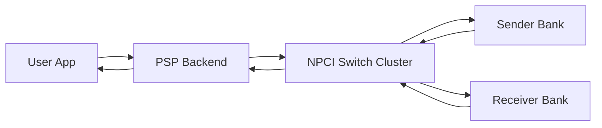
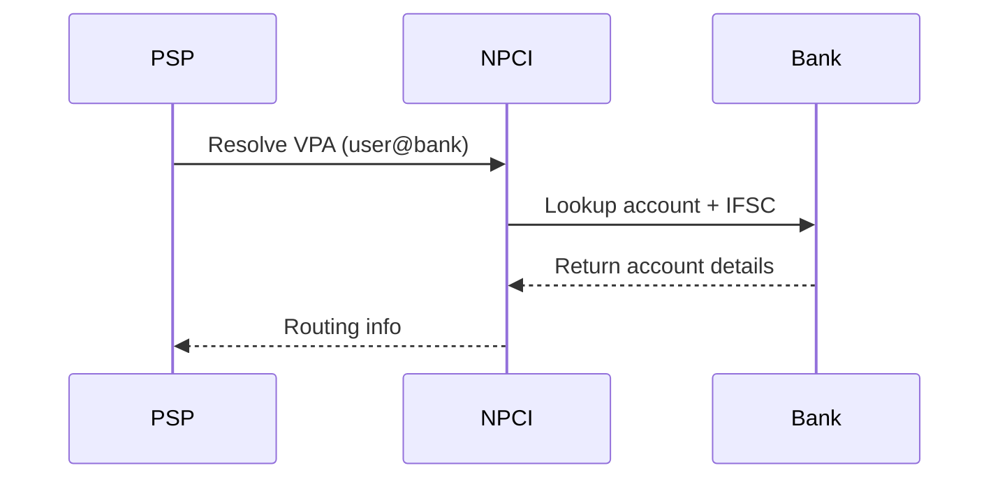
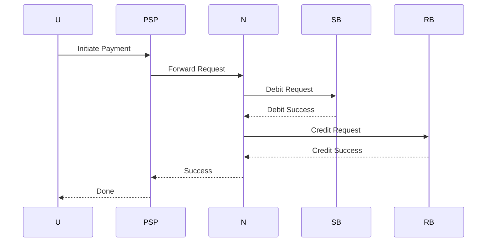
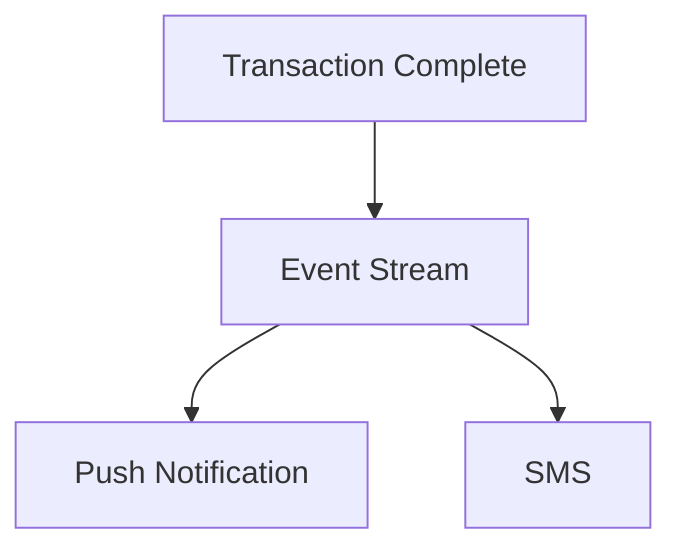

# 💳 UPI System Design (End-to-End, Real-Time Payments) — Production Grade

---

# 0. 📌 Assumptions

* Real-time payment UX target: < 2 seconds
* Settlement SLA: up to 30 seconds (bank-side)
* Strong consistency required for money movement
* Multi-PSP ecosystem (GPay, PhonePe, Paytm)

---

# 1. 🧠 Problem Statement

Design a UPI-like system that:

* Enables instant bank-to-bank transfers
* Ensures no double spending
* Handles massive scale (millions TPS bursts)
* Is fault-tolerant and reconcilable

---

# 2. 🏗️ High-Level Architecture (HLD)



---

# 3. 🔗 VPA Resolution Flow (CRITICAL)



👉 NPCI maps VPA → bank account + IFSC → routing

---

# 4. 🔄 End-to-End Flow



---

# 5. ⚙️ Transaction State Machine

```plaintext
INITIATED
 → PENDING_DEBIT
 → DEBITED
 → PENDING_CREDIT
 → COMPLETED

Failure Path:
DEBITED → REVERSAL_INITIATED → REVERSED
```

---

# 6. ⚙️ Low-Level Design (LLD)

## Data Models

```plaintext
Transaction(txn_id, status, amount, sender, receiver)
LedgerEntry(account_id, type, amount, txn_id)
```

---

# 7. 🧮 Double Entry Ledger

* Debit sender
* Credit receiver
* Sum(debit) = sum(credit)

---

# 8. 🧠 Debit Atomicity (IMPORTANT)

Banks ensure atomicity via:

```plaintext
Row-level locking on account row
```

### Approaches:

* Pessimistic locking → safe but slower
* Optimistic locking → faster but retry-heavy

---

# 9. 💰 Insufficient Balance Check

Performed at:

```plaintext
Sender Bank BEFORE debit
```

---

# 10. 🔁 Idempotency (FIXED)

```plaintext
If txn_id exists → return stored result
```

👉 NEVER ignore — always return cached response

---

# 11. ⚠️ Timeout Scenarios (CRITICAL FIX)

| Scenario                  | Action                |
| ------------------------- | --------------------- |
| Before debit              | Safe retry            |
| After debit before credit | Reconciliation needed |
| After credit              | Idempotent retry safe |

---

# 12. ⚠️ Failure Matrix (Improved)

| Scenario | Action |
Duplicate request | Return cached result |
Debit success, credit fail | Reverse |
Timeout | Depends on stage |

---

# 13. 📊 Scaling (Improved Explanation)

### Partitioning

```plaintext
txn_id hash → same shard
```

👉 Ensures idempotency consistency

---

# 14. 🚀 NPCI Redundancy

* Active-active data centers
* Geo-redundancy

If NPCI down:

```plaintext
PSP queues locally
```

---

# 15. 🔔 Notification System



---

# 16. 🛡️ Fraud & Limits

* Daily limits enforced at PSP
* Velocity checks
* Device anomaly detection

---

# 17. 🗄️ Database Choices

| Component    | DB             |
| ------------ | -------------- |
| Transactions | PostgreSQL     |
| Idempotency  | Redis          |
| Logs         | Cassandra / S3 |

---

# 18. 🔁 Reconciliation Cadence

* Near real-time stream reconciliation
* End-of-day settlement (T+0)

---

# 19. 📜 API Contract (Simplified)

```json
{
  "txn_id": "123",
  "amount": 100,
  "payer": "user@bank",
  "payee": "merchant@bank"
}
```

---

# 20. ⚡ Performance (Improved)

* p50: ~500ms
* p99: <2s
* Settlement SLA: <30s

---

# 21. 🧠 Key Insight

```plaintext
UPI = Coordination + Ledger + Reconciliation system
```

---

# 22. 🚀 Summary

* Strong consistency system
* Idempotent design
* Geo-redundant switch
* Real-time + async hybrid

---

## 👤 Author

Aditya

