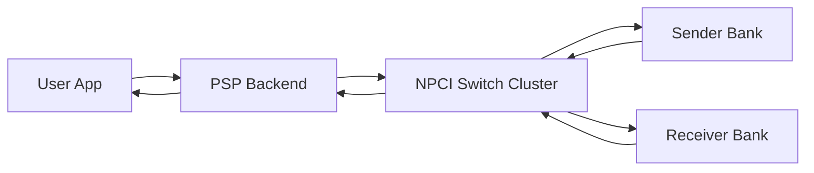
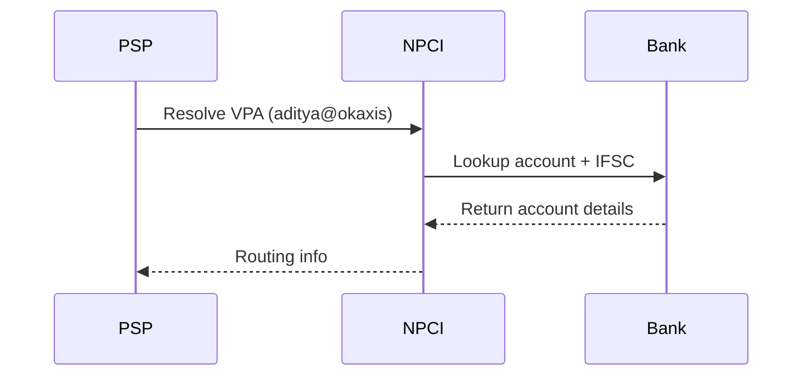
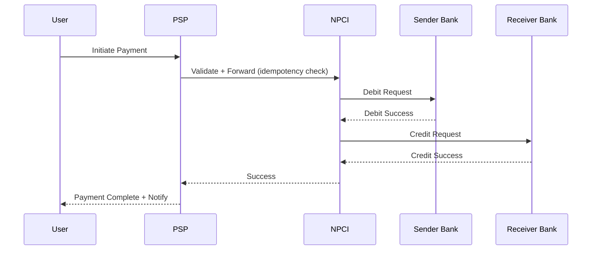
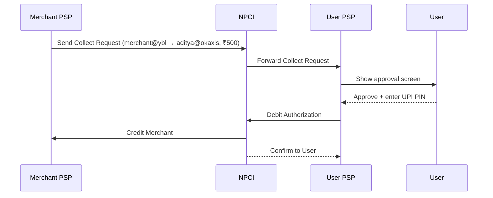
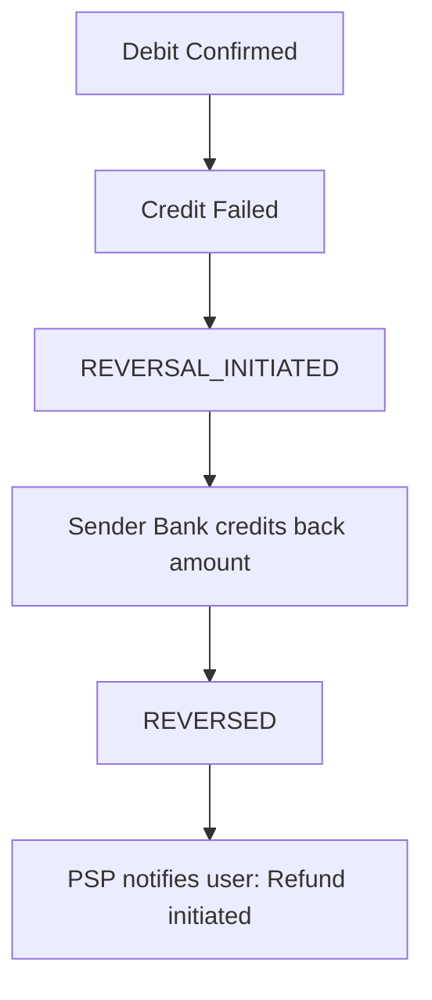
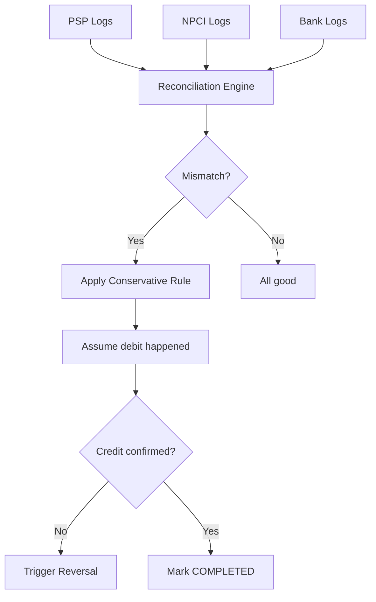
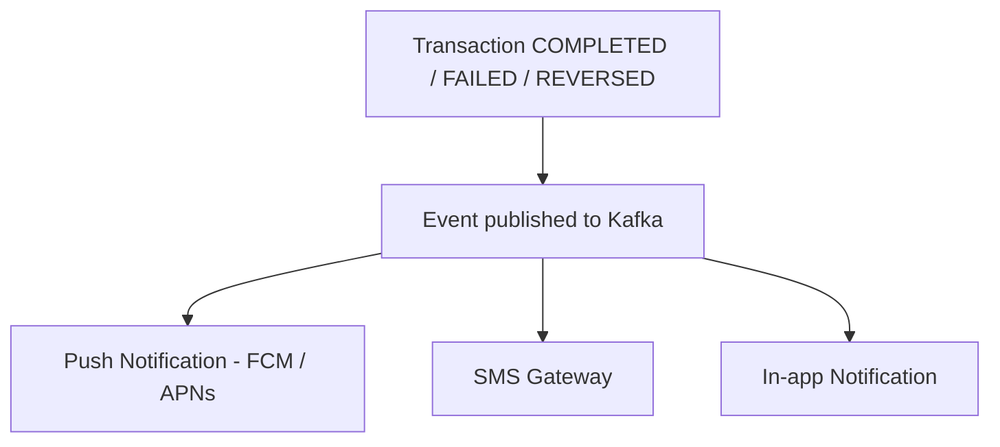

# 💳 UPI System Design (End-to-End, Real-Time Payments) 

> **Author:** Aditya Kumar Singh
> 
> **GitHub:** [facileWizard](https://github.com/facileWizard)
---

## 0. 📌 Assumptions

- Real-time payment UX target: < 2 seconds
- Settlement SLA: up to 30 seconds (bank-side)
- Strong consistency required for all money movement
- Multi-PSP ecosystem: GPay, PhonePe, Paytm
- UPI handles ~10,000–15,000 TPS at peak (not millions)

---

## 1. 🧠 Problem Statement

Design a UPI-like system that:

- Enables instant bank-to-bank transfers (24×7)
- Ensures no double spending with strong consistency
- Handles massive scale with fault tolerance
- Is idempotent, reconcilable, and secure

---

## 2. 🏗️ High-Level Architecture (HLD)



| Component | Role |
|---|---|
| User App (PSP) | UI + payment initiation |
| PSP Backend | Validation, idempotency, orchestration |
| NPCI Switch Cluster | Routing, coordination, geo-redundant |
| Sender Bank | Debit + ledger update |
| Receiver Bank | Credit + ledger update |
| Reconciliation Engine | Ensures correctness across systems |

---

## 3. 🔗 VPA Resolution Flow (CRITICAL)

Virtual Payment Address (VPA) is a human-readable alias (e.g. `user@bankname`). Before any payment, the VPA must be resolved to an actual bank account + IFSC code.



> **Key insight:** NPCI acts as a **directory** (knows which bank owns a VPA), but the **actual account mapping lives at the bank**. NPCI routes the lookup; the bank owns the data.

---

## 4. 🔄 End-to-End Payment Flow

### 4.1 Happy Path (Synchronous)



### 4.2 Insufficient Funds Path

Insufficient balance check happens at Sender Bank **before** any debit:

```
NPCI → Debit Request → Sender Bank
Sender Bank → checks balance
  If insufficient → return INSUFFICIENT_FUNDS to NPCI
NPCI → forward failure to PSP
PSP → return error to user
Transaction status: ABORTED (no reversal needed)
```

---

## 5. 🔄 Collect Flow — Pull Model (CRITICAL)

UPI has two payment models. Most designs only cover Push. **Collect is equally important.**

| Model | Who initiates | Example |
|---|---|---|
| **Push** | Payer sends money | You pay a friend |
| **Collect** | Payee requests money | Merchant requests payment from you |

### 5.1 Collect Flow



### 5.2 Where Collect Is Used

- QR code payments at shops
- Subscription / recurring payments (UPI AutoPay)
- E-commerce checkout (Flipkart, Swiggy)
- Bill payments

### 5.3 Key Differences from Push

```plaintext
Push:  Payer initiates → immediate
Collect: Payee initiates → waits for user approval
         Has expiry time (e.g. 10 minutes)
         User can decline
         Pending state until approved or expired
```

### 5.4 Collect State Machine Extension

```
COLLECT_REQUESTED
  → PENDING_APPROVAL   (waiting for user)
  → APPROVED           (user accepted + PIN entered)
  → DEBITED
  → COMPLETED

  → DECLINED           (user rejected)
  → EXPIRED            (approval window passed)
```

---

## 6. ⚙️ Transaction State Machine

```
INITIATED
  → PENDING_DEBIT        (debit request sent to bank)
  → DEBITED              (bank confirmed debit)
  → PENDING_CREDIT       (credit request sent to receiver)
  → COMPLETED            (credit confirmed)

Failure Path:
  DEBITED
    → REVERSAL_INITIATED (credit failed, reversal triggered)
    → REVERSED           (funds returned to sender)

  INITIATED → ABORTED    (debit failed / insufficient funds)
```

---

## 7. ⚙️ Low-Level Design (LLD)

### 7.1 Data Models

```plaintext
Transaction(
  txn_id           UUID        Primary key
  status           ENUM        State machine value
  amount           DECIMAL
  sender_vpa       STRING
  receiver_vpa     STRING
  sender_account   STRING      Resolved account
  receiver_account STRING      Resolved account
  created_at       TIMESTAMP
  updated_at       TIMESTAMP
  error_code       STRING      Null on success
)

LedgerEntry(
  entry_id         UUID
  account_id       STRING
  type             ENUM        DEBIT | CREDIT
  amount           DECIMAL
  txn_id           UUID        FK → Transaction
  created_at       TIMESTAMP
)
```

### 6.2 API Contract

**Request (PSP → NPCI):**
```json
{
  "txn_id":    "uuid-v4",
  "amount":    100.00,
  "payer":     "aditya@okaxis",
  "payee":     "merchant@ybl",
  "timestamp": "2024-01-01T10:00:00Z"
}
```

**Response (NPCI → PSP):**
```json
{
  "txn_id":     "uuid-v4",
  "status":     "COMPLETED | FAILED | PENDING",
  "error_code": "INSUFFICIENT_FUNDS | TIMEOUT | BANK_DOWN | null",
  "timestamp":  "2024-01-01T10:00:02Z"
}
```

---

## 8. 🧮 Double-Entry Ledger Design

Every transaction creates exactly two ledger entries:

```
Sender Account:    -100  (DEBIT)
Receiver Account:  +100  (CREDIT)

Invariant: Sum(all DEBITs) = Sum(all CREDITs)
```

This invariant is the foundation of reconciliation — any mismatch signals a failure that must be investigated.

---

## 9. 🔒 Debit Atomicity

Banks ensure atomicity via **database-level row locking** on the account during debit:

| Approach | Mechanism | Trade-off |
|---|---|---|
| Pessimistic Locking | Lock row before reading balance | Safe, but slower |
| Optimistic Locking | Read balance, CAS on write | Faster, but retry-heavy |

> Most banks use pessimistic locking — retry storms under optimistic locking are unacceptable for financial operations.

---

## 10. 💰 Insufficient Balance Check

Performed at **Sender Bank BEFORE debit**. If balance is insufficient, the transaction is immediately ABORTED — no reversal is needed since no money moved.

---

## 11. 🔁 Idempotency

```plaintext
On receive request(txn_id):
  result = Redis.get(txn_id)
  if result exists:
    return result          ← return CACHED response, NEVER ignore
  else:
    process transaction
    Redis.set(txn_id, result, TTL=24h)
    return result
```

> **Critical:** On duplicate request, always return the cached result. Silently ignoring leaves the client in an unknown state and may cause retries.

### 10.1 Exactly-Once vs At-Least-Once (STRONG INTERVIEW LINE)

```plaintext
UPI delivery guarantee:
  → At-least-once delivery     (network retries can re-send a request)
  → Exactly-once financial effect (idempotency ensures money moves only once)

This is the key distinction:
  The network may deliver a message multiple times.
  The system ensures the side effect (debit/credit) happens exactly once.
```

> **Elite interview line:** "UPI guarantees exactly-once financial effect using idempotency over at-least-once delivery."

---

## 12. ⚠️ Timeout Scenarios (CRITICAL)

Not all timeouts are equal — the correct action depends on **when** the timeout occurred:

| Timeout Stage | Risk | Correct Action |
|---|---|---|
| Before debit sent | None | Safe to retry |
| After debit, before credit | High — money in limbo | Do NOT retry blindly — reconcile first |
| After credit confirmed | None | Idempotent retry safe |

---

## 13. 🕐 Clock Skew & Out-of-Order Retries

**Edge case:** Two retries of the same transaction arrive at different nodes out of order due to network delays or clock drift.

**Why this is dangerous:**
```plaintext
Retry 1 arrives at t=5s  → starts processing
Retry 2 arrives at t=3s  → also starts processing
→ Without protection: two debits possible
```

**Solution — txn_id + state machine is the guard:**
```plaintext
Both retries carry the same txn_id
First to reach Redis sets the idempotency lock
Second hits the cache → returns existing result
State machine prevents transitioning backwards
  (e.g. COMPLETED → PENDING_DEBIT is impossible)
```

> Clock skew does NOT break UPI correctness because **txn_id is the source of truth**, not timestamps. Timestamps are for ordering logs only.

| Scenario | Result | Action |
|---|---|---|
| Debit success, credit success | ✅ | Complete — notify user |
| Debit success, credit failed | ❌ | Trigger reversal → REVERSED |
| Debit success, response timeout | ⚠️ | Reconcile → reverse if credit unconfirmed |
| Debit failed / insufficient funds | ❌ | Abort — return error |
| Duplicate request received | ⚠️ | Return cached result from Redis |

---

## 14. 🔁 Reversal Flow



> Reversal must also be idempotent — if the reversal request times out, it can be safely retried with the same txn_id.

---

## 15. 🔥 Hot Account / Hot Merchant Problem

**Problem:** During a Flipkart sale or IPL ticket launch, millions of users hit the **same merchant VPA** simultaneously.

```plaintext
Flipkart sale → 500,000 payments/min → same merchant account
→ Same DB row → row-level lock contention
→ Bank DB becomes the bottleneck → cascading timeouts → failures
```

### 14.1 Solutions

| Solution | How It Works | Trade-off |
|---|---|---|
| **Sharded merchant accounts** | Merchant has N sub-accounts (flipkart_1@ybl … flipkart_N@ybl) | Credits split across shards, aggregated later |
| **Virtual accounts** | Each transaction gets a unique virtual account | No contention — settled to master account async |
| **Queueing at bank layer** | Bank serializes writes via internal queue | Protects DB, adds slight latency |
| **Write coalescing** | Batch multiple small credits into one DB write | Reduces lock operations per second |

### 14.2 Virtual Account Pattern (Most Common)

```plaintext
Merchant registers: flipkart@ybl (master account)
NPCI generates:     va_txn123@ybl (virtual, per-transaction)

Each payment credits a unique virtual account → zero row contention
Async settlement job aggregates virtual → master account
```

> **Elite insight:** "Hot accounts are mitigated via virtual accounts and sharding — the real account never sees direct lock contention at scale."

---

## 16. 🛡️ Fraud Detection & Limits

### 16.1 Limit Enforcement (PSP Layer)

- Per-transaction limit: enforced before forwarding to NPCI
- Daily limit per user: Redis counter reset at midnight
- Per-PSP rate limits: prevent single PSP from overloading NPCI

### 16.2 Fraud Detection Architecture

| Layer | Mechanism | Action on Hit |
|---|---|---|
| PSP (pre-payment) | Velocity check: >N txns/min via Redis sliding window | Block transaction |
| NPCI (cross-PSP) | Cross-PSP fraud signals in real-time | Throttle or block VPA |
| Async (post-payment) | ML model on transaction patterns | Flag for review, auto-freeze |

**Velocity Check (Redis Sliding Window):**
```plaintext
key = "velocity:{user_id}"
ZADD key timestamp txn_id
ZREMRANGEBYSCORE key 0 (now - 60s)
count = ZCARD key
if count > threshold: BLOCK
```

---

## 17. 🔁 Reconciliation System

### 17.1 Why It Exists

PSP, NPCI, and banks may disagree on transaction status due to network failures or timeouts. Reconciliation detects and resolves these mismatches.

### 17.2 Cadence

- **Near-real-time:** Stream-based comparison as events flow (Kafka consumers comparing PSP vs NPCI logs)
- **End-of-day batch:** T+0 settlement — full ledger reconciliation across all banks

### 17.3 Mismatch Resolution



```plaintext
Conservative Rule:
  If mismatch detected → assume debit happened
  If credit unconfirmed → trigger reversal
  If credit confirmed but PSP shows FAILED → mark COMPLETED
  Log all overrides for audit
```

---

## 18. 🔔 Notification System



> **Refined model:** Notifications use **at-least-once delivery + client-side deduplication**. Users MUST see the outcome (success/failure) — fire-and-forget with no retry is insufficient. The client deduplicates by txn_id to avoid showing the same notification twice.

---

## 19. 🗄️ Database Technology Choices

| Component | Database | Reason |
|---|---|---|
| Transactions table | PostgreSQL | ACID, row-level locking, strong consistency |
| Idempotency cache | Redis | Sub-millisecond key lookup, TTL support |
| Audit / reconciliation logs | Cassandra / S3 | Append-heavy, high volume, cheap storage |
| Fraud velocity counters | Redis | Atomic ZADD/ZCARD, sliding window |
| VPA registry | PostgreSQL (NPCI) | Read-heavy, consistency critical |

---

## 20. 🚀 NPCI Redundancy

- Active-active data centers across geographies
- Traffic load-balanced across the cluster
- No single point of failure at switch level

**If NPCI is unreachable:**
```
PSP queues transactions locally (durable queue)
PSP retries with exponential backoff
User sees "Payment processing..." status
Transaction eventually resolves or times out → reconciliation
```

---

## 21. 📊 Scaling Strategy

### 19.1 Partitioning

```plaintext
shard = hash(txn_id) % N
→ All operations for a txn hit the same shard
→ Ensures idempotency check is consistent
→ Prevents race conditions across nodes
```

**Hot partition avoidance:**
```plaintext
❌ hash(merchant_id) → all Flipkart txns → same shard → hot partition
✅ hash(txn_id)      → random distribution across shards
✅ hash(merchant_id + txn_id) → composite key if merchant routing needed
```

### 19.2 Horizontal Scaling

- PSP backends: stateless, scale independently
- NPCI switch: distributed cluster, active-active
- Bank APIs: partitioned by account range

### 19.3 Burst Handling

| Technique | Purpose |
|---|---|
| Rate limiting (per user/PSP) | Prevent overload at entry |
| Backpressure | Slow upstream when downstream (bank) is slow |
| Circuit breaker | Stop traffic to consistently failing bank |
| Timeout + fail fast | Prevent request pile-up |
| Auto-scaling | Add instances during peak events (IPL, salary day) |

### 19.4 Retry Storm Protection

**Problem:** If a bank is slow, thousands of clients retry simultaneously → overload → full collapse.

```plaintext
Bank slow at t=1s → 10,000 clients time out at t=2s
→ All retry immediately → 10,000 new requests hit already-overloaded bank
→ Complete collapse (thundering herd)
```

**Solution — Exponential Backoff + Jitter + Retry Budget:**

```plaintext
Exponential Backoff:
  retry_delay = base * 2^attempt
  attempt 1 → wait 1s
  attempt 2 → wait 2s
  attempt 3 → wait 4s

Jitter (CRITICAL):
  retry_delay = base * 2^attempt + random(0, 1s)
  → Spreads retries across time window, breaks synchronization

Retry Budget:
  Max 3 retries per transaction
  Max N retries/sec globally across all transactions
  → Prevents infinite retry loops under sustained failure
```

> Without jitter, all clients retry at the same instant — making the outage worse. Jitter is not optional.

### 19.5 Sync vs Async Split (Key Insight)

```plaintext
Critical Path (SYNCHRONOUS):
  User → PSP → NPCI → Banks → Response
  Requirements: low latency (<2s), strong consistency

Supporting Systems (ASYNCHRONOUS):
  Retry workers, reconciliation, notifications, analytics
  Uses Kafka event stream — NOT in critical payment path

Why NOT Kafka in critical path?
  Kafka = high throughput + async
  UPI  = low latency + sync consistency
  → Async would break real-time guarantees
```

---

## 22. ⚡ Performance Targets

| Metric | Target |
|---|---|
| p50 latency (end-to-end) | ~500ms |
| p99 latency (end-to-end) | < 2 seconds |
| Settlement SLA | < 30 seconds (bank-side) |
| Peak throughput | ~10,000–15,000 TPS |
| Idempotency cache lookup | < 5ms (Redis) |
| Notification delivery | < 5 seconds (async) |

> **Tail latency insight:** The system is only as fast as the **slowest bank in the transaction chain**. p99 is dominated by outlier bank response times, not PSP or NPCI. This is why circuit breakers and timeouts per bank are critical — one slow bank should not degrade the entire system.

---

## 23. 🔐 Security Deep Dive

### 21.1 UPI PIN Encryption

```plaintext
1. User enters PIN in secure input (Android Keystore / iOS Secure Enclave)
2. App encrypts PIN using Bank's PUBLIC KEY
3. Encrypted payload sent over TLS (double protection)
4. Only Bank's PRIVATE KEY can decrypt — PSP and NPCI cannot read PIN

Threat Protection:
  Network sniffing   → blocked by TLS + payload encryption
  Malicious app      → cannot access secure input layer
  Server compromise  → encrypted payload useless without private key
```

> **Interview gold:** "Even GPay / PhonePe cannot see your UPI PIN."

### 21.2 SIM + Device Binding

```plaintext
Multi-Factor Trust Model:
  Trust = Device Binding + SIM Binding + UPI PIN

Device Binding (onboarding):
  App sends silent SMS via SIM → bank verifies mobile number
  Device gets registered: device_id + token stored

Runtime SIM Validation (each payment):
  Check: Is SIM present?
  Check: Does SIM number match registered number?
  If failed → Block transaction → Trigger re-verification

Edge Cases:
  SIM removed   → block payments
  SIM swapped   → force re-registration
  App reinstall → device binding reset
  Dual SIM      → use registered SIM only
```

---

## 24. ⚖️ Trade-off Analysis

| Decision | Benefit | Cost |
|---|---|---|
| Strong consistency | No money loss | Slightly higher latency |
| Central NPCI switch | Unified routing, cross-PSP interop | Needs geo-redundancy |
| Sync critical path | Real-time UX guarantee | Complex failure handling |
| Pessimistic locking | Safe atomicity | Lower throughput under contention |
| Double-entry ledger | Easy reconciliation | 2× writes per transaction |

---

## 25. ❓ Interview Questions (High Signal)

| Question | Gold Answer |
|---|---|
| How do you prevent double debit? | Idempotency key (txn_id) checked in Redis. If exists, return cached result. |
| What if credit fails after debit? | Trigger reversal: DEBITED → REVERSAL_INITIATED → REVERSED |
| How do you handle bank timeout? | Depends on stage. Before debit: retry. After debit: reconcile first. |
| Can UPI be eventually consistent? | No. Money requires strong consistency — eventual risks double spend or lost funds. |
| What if two systems disagree? | Reconciliation engine. Conservative rule: assume debit happened. Reverse if credit unconfirmed. |
| How is UPI PIN secured? | Encrypted on-device with bank's public key, sent over TLS. PSP cannot decrypt it. |
| How to scale for IPL peak? | Rate limit at entry, auto-scale PSP/NPCI, circuit break failing banks, async for non-critical. |
| What is the Collect flow? | Payee initiates a pull request → user approves + enters PIN → payment executes. Used in QR, subscriptions, e-commerce. |
| How do you handle a hot merchant account? | Virtual accounts per transaction eliminate row contention. Async settlement aggregates to master account. |
| Is UPI exactly-once? | At-least-once delivery + exactly-once financial effect via idempotency. The network may retry; money moves only once. |
| What causes retry storms and how do you prevent them? | Synchronized retries overwhelm a slow bank. Exponential backoff + jitter + retry budget breaks the thundering herd. |
| What drives p99 latency in UPI? | The slowest bank in the chain. Circuit breakers isolate slow banks so one outlier doesn't degrade the whole system. |

---

## 26. 🧠 Key Insights

```plaintext
UPI = Coordination System + Ledger System + Reconciliation System

It is NOT just a payment system.
Every design decision flows from: strong consistency + fault tolerance.
```

**Three lines that separate good from elite:**

```plaintext
1. "UPI guarantees exactly-once financial effect using idempotency
    over at-least-once delivery."

2. "The system is only as fast as the slowest bank in the
    transaction path — tail latency is a bank problem, not a UPI problem."

3. "Hot accounts are mitigated via virtual accounts and sharding —
    the real account never sees direct lock contention at scale."
```

**Advanced flex line:**

```plaintext
"UPI transactions are short-lived distributed transactions —
 not long-running sagas — with compensation via reversal
 rather than rollback."
```

**Interview killer answer:**

> "UPI uses a synchronous architecture for the critical payment flow to guarantee consistency, while async systems handle retries, reconciliation, and notifications. Idempotency + double-entry ledger + reversal flows ensure no money is ever lost or duplicated."

---

## 27. 🚀 Summary

- Strong consistency system — no eventual consistency for money
- Idempotent design — safe retries, no double debit
- Geo-redundant NPCI switch — no single point of failure
- Real-time sync + async hybrid — best of both worlds
- Reconciliation as safety net — catches what everything else misses
