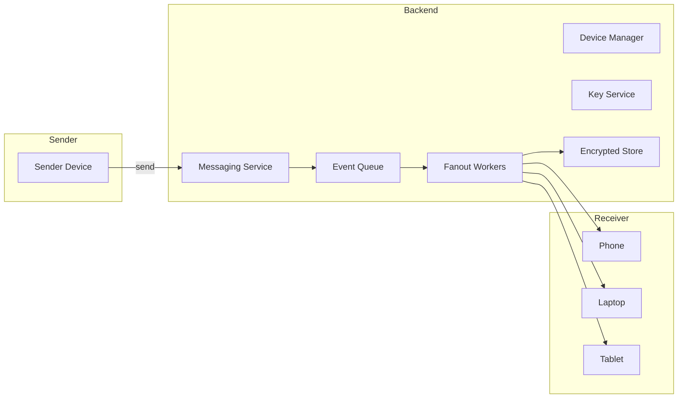
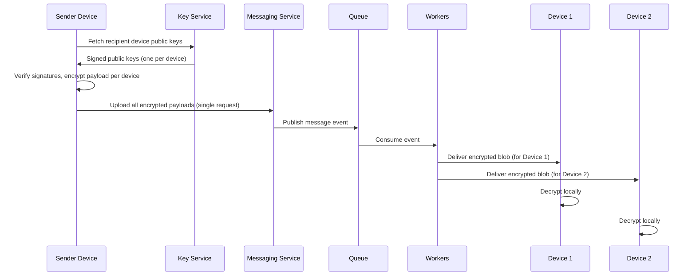
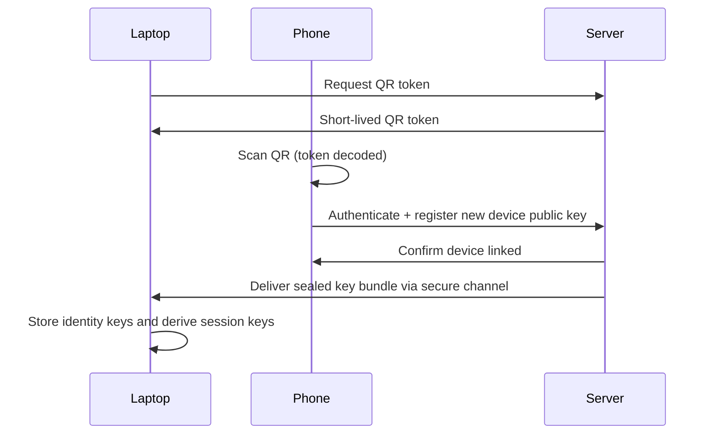
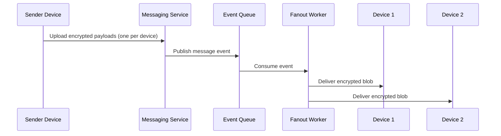

# 📲 WhatsApp Multi-Device System Design (E2E + Sync)

---

# 1. 🧠 Problem Statement

Design a system like WhatsApp that:

* Supports multiple devices per user (phone, web, desktop)
* Works even if the primary phone is offline
* Maintains strict end-to-end encryption (E2E)
* Syncs messages reliably across devices
* Handles offline devices and eventual consistency

---

# 2. 🏗️ High-Level Architecture (HLD)



---

# 3. 🔐 Core Principle

👉 Encrypt **per device**, not per user

Each device has its own:

* Identity key pair
* Session keys per chat

---

# 3a. 📤 Sender-Side Fanout

**Who computes fanout — client or server?**

The sender device performs fanout at encryption time:

1. Fetch all recipient device public keys from the Key Service
2. Encrypt one payload per device (locally, on the sender)
3. Upload all payloads in a single request to the server

The server does **not** perform encryption fanout. This is a deliberate privacy decision — the server never holds plaintext or the keys needed to produce it.

---

# 3b. 🔑 Key Distribution

Before sending, the sender must obtain the recipient's device keys:

- Sender queries the Key Service for all public keys registered to the recipient user
- Each key is signed by the recipient device and verified by the sender to prevent MITM attacks
- The Key Service is append-only for new device registrations; revoked devices are removed and senders re-fetch before the next message

---

# 4. 🔄 End-to-End Message Flow



---

# 5. 🔗 Device Linking (QR Flow)



> **Note:** Keys are never transmitted directly phone→laptop. The phone registers the new device with the server, which then delivers an encrypted key bundle to the laptop via a server-mediated secure channel.

---

# 6. ⚙️ Low-Level Design (LLD)

## Data Models

```plaintext
User {
  user_id
}

Device {
  device_id
  user_id
  public_key
  last_seen
}

Message {
  message_id
  sender_id
  receiver_id
  timestamp
  sequence_number   // per-conversation monotonic counter for ordering
}

EncryptedPayload {
  message_id
  device_id
  encrypted_blob
}

DeviceSyncCursor {
  device_id
  conversation_id
  last_sequence_number  // tracks sync position per conversation
}
```

---

## APIs

### Send Message

```
POST /send
```

### Fetch Messages

```
GET /messages?device_id&conversation_id&after_sequence=<seq>
```

### Link Device

```
POST /link-device
```

---

# 7. 🧩 Event-Driven Architecture



---

# 8. ⚠️ Critical Failure Scenarios

## Case 1: Sender offline BEFORE send

👉 Message exists only locally — no server involvement yet.

No server record. No queue entry. No sync to other devices.

## Case 2: Sender offline AFTER send

👉 Message is already in the queue → delivery is safe and will proceed.

## Case 3: Receiver offline

👉 Encrypted payload is stored on the server and delivered when the device reconnects.

## Case 4: Sending from a linked device (not the primary phone)

👉 Linked devices **can** send messages. Session keys are established via X3DH (Extended Triple Diffie-Hellman) key agreement at link time, then advanced forward on each message using the Signal double-ratchet. A linked device uses these keys to encrypt and send independently, without needing access to the primary phone.

---

# 9. 🔁 Sync Logic

Each device tracks a sync cursor **per conversation**:

```plaintext
DeviceSyncCursor {
  device_id
  conversation_id
  last_sequence_number
}
```

On reconnect:

- Fetch messages for each conversation where `sequence_number > last_sequence_number`
- Apply messages in sequence order
- Update cursor after each batch is successfully processed

> **Why not `last_sync_timestamp`?** Timestamps can collide or drift across distributed servers. A monotonic sequence number per conversation guarantees correct ordering and idempotent catch-up without race conditions.

---

# 10. 🔁 Deduplication

Each message carries a globally unique `message_id`. Devices and servers ignore any payload whose `message_id` has already been processed.

---

# 11. 🔐 Security Model

- End-to-end encryption — server never has access to plaintext
- Device-specific encryption — each linked device gets its own encrypted copy
- No shared plaintext between devices — decryption happens locally
- Key rotation triggered on device unlink, session expiry, or manually by the user; implemented via the Signal double-ratchet protocol so forward secrecy is preserved

---

# 12. 📊 Scaling Strategy

- Fan-out per device: one encrypted payload delivered per registered device
- Async queue: decouples send from delivery
- Parallel workers: multiple fanout workers handle delivery concurrently
- For users with many linked devices (up to 5), fanout is bounded and workers can batch deliveries to avoid thundering-herd on reconnect
- For high throughput: conversations are sharded by `conversation_id`; each shard independently assigns sequence numbers and handles fanout, so there is no global ordering bottleneck

---

# 13. ⚡ Performance

| Stage    | Time   |
| -------- | ------ |
| Send     | ~100ms |
| Queue    | ~200ms |
| Delivery | ~500ms |

---

# 14. ⚖️ Trade-offs

## Why per-device encryption?

- **Pro:** Strong privacy — server cannot decrypt any message
- **Con:** Higher compute cost on sender (must encrypt N times for N devices)

## Why no shared drafts?

- **Pro:** Eliminates any server-side plaintext surface
- **Con:** UX limitation — a draft started on one device is not visible on others

## Why eventual consistency?

- **Pro:** Scalability — delivery can proceed asynchronously across devices
- **Con:** Temporary ordering mismatch between devices until sync completes

---

# 15. ❓ Interview Questions

### Q1: Why not sync unsent messages?

👉 Because encryption keys are device-specific. A message that never reached the server has no encrypted payload for other devices to receive.

### Q2: Can the server decrypt messages?

👉 No. The server only stores and forwards opaque encrypted blobs. Decryption keys never leave the devices.

### Q3: How are multiple devices handled?

👉 The sender encrypts the message separately for each registered device and uploads all payloads in a single request. Fanout workers deliver the appropriate blob to each device.

### Q4: What if a device is lost?

👉 The user revokes the device. The server removes its registered public key, stops delivering to it, and triggers key rotation for active sessions to preserve forward secrecy.

### Q5: How is message ordering handled?

👉 Conversations are sharded by `conversation_id`. Sequence numbers are maintained per conversation shard and assigned by the messaging service responsible for that shard, ensuring monotonic ordering within a conversation. If two messages arrive simultaneously within the same shard, the service resolves the tie by insertion order and assigns distinct sequence numbers. Devices apply messages in sequence order on sync.

### Q6: How does offline sync work?

👉 Each device tracks a `last_sequence_number` cursor per conversation. On reconnect, it fetches all messages with a higher sequence number and applies them in order.

---

# 16. 🧠 Key Insight

If a message never reaches the server, it does not exist globally. The server is the boundary between local device state and the shared message graph.

---

# 17. 🚀 Summary

- Devices are independent encryption endpoints
- Server is a relay and temporary encrypted store — never a decryption point
- Encryption is per device, not per user
- Queue and fanout only activate after the sender successfully uploads all payloads
- Sync uses per-conversation sequence numbers, not timestamps

---

## 👤 Author

Aditya
